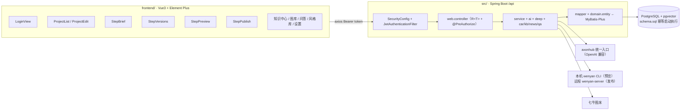
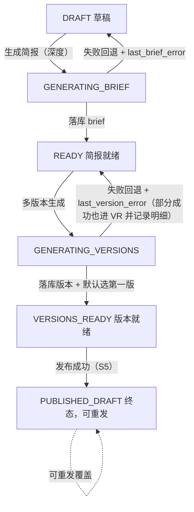

# Sparkora 系统说明（总览）

> 本文件是系统说明文档的**唯一入口**。模块级权威契约在 `docs/spec/**`；代码路径以本页模块索引表为准。

新媒体内容创作平台：AI 辅助的「主题 → 简报 → 多版本正文 → 编辑 → 发布」创作工作台。

---

## 1. 系统定位与双模块架构

- **后端** `src/` — Spring Boot 3.3.4（Java 21）+ MyBatis-Plus 3.5.7 + Spring Security（JWT，jjwt 0.12.6）+ PostgreSQL。入口 `src/main/java/com/sparkora/SparkoraApplication.java`，包结构 `com.sparkora`，Maven 构建（`pom.xml`）。
- **前端** `frontend/` — Vue 3 + Vite 5 + Element Plus 2.8 + Pinia + vue-router，`unplugin-auto-import`/`unplugin-vue-components` 自动引入 Element Plus 组件。移动端优先响应式，不引 Vant 等额外移动端框架。
- **流程主线（四步）**：简报 → 版本 → 预览（含配图）→ 发布。2026-08-28 取消「校验」步；2026-09-03（S6）配图并入预览、移除 `IMAGES_READY`。
- **生成主线（唯一）**：快速模式 FAST 已下线（接口保留但恒 410），所有简报生成/正文生成必走**深度模式**（六阶段）。权威契约见 [brief-generation.md](spec/brief-generation.md)。



---

## 2. 概念地图

### 创作主线

```
创作项目(ArticleProject)
  └─ 简报(Brief)                    ← 深度链路六阶段产出（研究计划→澄清→并行研究→事实手册→简报）
       └─ 多版本正文(ArticleVersion) ← 每选一个风格生成一版（label/styleTag/wordCount/ragStatus/factRisks）
            ├─ 配图(ImageAsset)       ← 版本级封面 cover_image_id + 正文插图 body_image_ids；图库 + AI 生图 + BYD 同步
            ├─ 预览(Preview)          ← wenyan CLI 同核渲染 → HTML（degraded 降级链）
            └─ 发布(Publish)          ← gzhContent JSON → wenyan-server upload/publish → 公众号草稿箱
```

### 三域知识 + 问答

```
统一检索（同向量空间 1024d，HNSW cosine）
  ├─ CAR  车型域  sparkora_car_doc_embedding      锚点加权 AI_RAG_ANCHOR_BOOST
  ├─ KB   通用域  sparkora_kb_chunk_embedding     AI_RAG_KB_ENABLED / AI_RAG_KB_TOPK
  └─ NEWS 新闻域  sparkora_news_doc_embedding     AI_RAG_NEWS_TOPK（不受 KB 开关控制）
        │
        ├─→ 生成注入：简报/正文（RAG 必查 + 降级可见，ragStatus 四态）
        └─→ 多轮问答（/qa，三域合成 + 来源引用 + 答案配图）
```

- 图片域 `sparkora_image_embedding` 与三域**同模型同维度同空间**，但检索入口独立（`POST /api/images/search`），不并入 `searchTopKUnified`。
- 知识域与问答的浏览/问答**不受** `kb_enabled` 控制，仅生成注入可开关。

---

## 3. 模块索引表

| 模块 | 文档 | 权威代码路径（后端包·关键类 / 前端视图） |
|---|---|---|
| 系统约定（`R<T>`/错误矩阵/状态机/角色） | [spec/overview.md](spec/overview.md) | `com.sparkora.common.R`、`web.controller.ApiExceptionHandler` |
| 登录与会话 | [spec/overview.md](spec/overview.md) | `com.sparkora.security.*`（`SecurityConfig`/`JwtAuthenticationFilter`/`JwtUtil`）、`web.controller.AuthController` / `views/LoginView.vue`、`store/user.js` |
| 项目生命周期（工作台/新建/详情） | [spec/project-lifecycle.md](spec/project-lifecycle.md) | `web.controller.ArticleProjectController`、`domain.entity.ArticleProjectEntity` / `views/ProjectList.vue`、`ProjectEdit.vue`、`project/ProjectLayout.vue` |
| 简报生成（深度模式·核心） | [spec/brief-generation.md](spec/brief-generation.md) | `deep.service.*`（`ClarifyService`/`DeepResearchService`/`FactSheetService`/`SubAgentRunner`）、`deep.tool.*`、`web.controller.DeepController`、`service.BriefService` / `project/StepBrief.vue`、`project/deep/*` |
| 版本生成 | [spec/version-generation.md](spec/version-generation.md) | `service.VersionService`、`deep.service.DeepWriterService` / `project/StepVersions.vue` |
| 风格库 | [spec/style-library.md](spec/style-library.md) | `web.controller.StyleController`、`service.StyleService`、`domain.entity.StyleProfileEntity` / `views/StyleLibrary.vue` |
| 配图 | [spec/image.md](spec/image.md) | `web.controller.ImageController`、`service.ImageService`/`ImageTagService`/`ImageEmbeddingService`/`IllustrationSuggestionService`、`image.embed.ImageEmbeddingTextBuilder`、`storage.ImageStorage`/`QiniuService` / `views/ImageLibrary.vue`、`components/MarkdownEditor.vue` |
| 知识库检索（RAG 必查+降级可见） | [spec/retrieval.md](spec/retrieval.md) | `com.sparkora.car`（`CarRagService.retrieveForGeneration`）、`mapper.CarDocEmbeddingMapper.searchTopKUnified`、`ai.EmbeddingClient` / `project/deep/CitationList.vue` |
| 系统检索设置 | [spec/settings.md](spec/settings.md) | `web.controller.SettingController`、`service.SettingService`、`domain.entity.SettingEntity` / `views/SettingsView.vue`、`layouts/TopBar.vue` |
| 排版预览 | [spec/preview.md](spec/preview.md) | `service.PreviewService`/`WenyanThemeCatalog`/`WenyanServerService` / `project/StepPreview.vue` |
| 公众号发布 | [spec/publish.md](spec/publish.md) | `service.PublishService`/`WenyanServerService`、`wenyan.*` / `project/StepPublish.vue` |
| 文章仿写 | [spec/imitation.md](spec/imitation.md) | `service.ImitationService`、`service.VersionService`（仿写分支） / `views/ProjectEdit.vue`、`project/StepBrief.vue`、`project/StepVersions.vue` |
| 知识域 · 车型（CAR） | [spec/knowledge/car.md](spec/knowledge/car.md) | `com.sparkora.car.*`（`CarModelService`/`CarDocService`/`CarSyncJobService`/`CarSyncScheduler`）、`web.controller.CarModelController` / `views/CarLibrary.vue`、`CarDetail.vue`、`CarSync.vue` |
| 知识域 · 通用知识库（KB） | [spec/knowledge/kb.md](spec/knowledge/kb.md) | `com.sparkora.kb.service.KbDocService`、`web.controller.KbDocController` / `views/KbLibrary.vue` |
| 知识域 · 官方新闻（NEWS） | [spec/knowledge/news.md](spec/knowledge/news.md) | `com.sparkora.news.*`（`client.BydNewsClient`/`service.NewsService`/`service.NewsDocService`/`service.NewsSyncJobService`/`service.NewsSyncScheduler`/`classify.NewsImageClassifier`）、`web.controller.NewsController` / `views/knowledge/NewsKnowledgePanel.vue` |
| 知识中心浏览页 | [spec/knowledge/center.md](spec/knowledge/center.md) | `frontend/src/router/index.js`（`/knowledge`） / `views/KnowledgeCenter.vue`、`views/knowledge/*` |
| 多轮对话式问答（QA） | [spec/knowledge/qa.md](spec/knowledge/qa.md) | `com.sparkora.qa.service.*`（`QaService`/`QaImageRefService`/`QaImageIntent`）、`web.controller.QaController` / `views/QaChat.vue` |
| 历史验收清单（只读快照） | [spec/acceptance.md](spec/acceptance.md) | —（2026-08-18 历史快照，不再维护） |

### 深潜文档（保留）

| 文档 | 定位 |
|---|---|
| [knowledge-base.md](knowledge-base.md) | 知识基座深潜：R4 评估结论、三域架构、多轮问答实现细节、数据同步 |
| [wenyan.md](wenyan.md) | wenyan 主题与发布机制深潜：双通道、15 主题目录、`--custom-theme` 用法与限制、新增主题步骤 |
| [img.md](img.md) | 七牛图床接入（配置/签名/端点/key 策略；密钥只放 `.env`） |
| [article-generation-flow.md](article-generation-flow.md) | 当前唯一深度链路的端到端流程图（含状态机与关键机制） |

---

## 4. 全局约定

### 4.1 统一响应与错误矩阵

- 所有 `/api` 接口统一 `R<T>` = `{code, msg, data}`；`code=0` 成功，失败用 `R.fail(code, msg)`（msg 中文）。
- **业务失败（含登录失败、生成失败）均为 HTTP 200 + `R.fail`**，前端不能只依赖 axios 错误拦截器，必须检查 `code`（`store.login` / `ProjectEdit` / `StepBrief` / `StepVersions` 已逐处落实）。
- 框架层参数异常由 `ApiExceptionHandler` 统一收敛为 `R.fail(400, 中文提示)`：类型不匹配（`参数 X 格式不正确`）、缺参（`缺少必填参数: X`）、请求体不可读（`请求体格式不正确`）、`@Valid` 校验失败（取首条中文提示）、multipart 超限/损坏（`上传失败: …`）。
- 常见业务码：400 参数/前置不满足、401 未认证、403 角色不足、404 不存在/越权（统一不泄露存在性）、409 状态冲突（生成中/陈旧冲突）、410 接口已封死、500 调用失败。

### 4.2 状态机总览（`ArticleProject.status`）

S3b 起共 6 态（2026-08-28 取消「校验」步故无 `FACT_CHECK`；2026-09-03 S6 移除 `IMAGES_READY`）：



- **DRAFT**：刚创建（`add` 即 DRAFT）；简报生成失败也回退到此态。
- **GENERATING_BRIEF**：简报生成进行中（先落库再调 AI，前端可观察；再次触发 409）。
- **READY**：简报就绪（`current_brief_id` 指向最新简报）。
- **GENERATING_VERSIONS**：多版本生成进行中（每风格一版；再次触发 409）。
- **VERSIONS_READY**：至少一版成功（`current_version_id` 默认指向本次第一版；全部失败才回退 READY）。S6 起版本就绪后**直接可预览/发布**。深度单版生成（`/deep/generate`）同样推进 READY→VERSIONS_READY（2026-09-10 修复：落版本后由 `DeepController` 成功分支推状态 + 首版设 current）。**存量数据自愈**（09-10-versions-page-fix）：`schema.sql` 启动时把历史「有版本但仍 READY/DRAFT」的项目推到 VERSIONS_READY，`current_version_id` 为空时设首版（幂等）。
- **PUBLISHED_DRAFT**（S5 新增，终态）：发布成功（渲染 HTML 经 wenyan-server 写入公众号草稿箱，拿到 `media_id`）。可重发：再次 `POST /publish` 重新渲染并覆盖草稿，刷新 `publish_media_id`/`published_at`/`publish_theme`；发布失败状态原样保留并写 `last_publish_error`（成功后清空）；`publish` 仅在 VERSIONS_READY/PUBLISHED_DRAFT 可调用，否则 `R.fail(400)`。
- 前端状态映射唯一事实源：`frontend/src/constants/project.js`（文案/标签色/步骤推进/生成中判定/发布判定 `isPublishable`/`isPublished`）。S6 起 `statusMeta` 对历史残留 `IMAGES_READY` 归一为 `VERSIONS_READY`。
- **状态守护（2026-09-01 定稿）：下游步骤已触发后，上游生成动作前后端双重拦截，禁止状态机回退。**
  - 后端：`generate/brief` 仅在 DRAFT/READY、`generate/versions` 仅在 READY/VERSIONS_READY 放行（条件更新 WHERE 白名单；「生成中且陈旧超 10 分钟」分支自愈但同样限定生成中状态）；违反返回 `R.fail(409, "…下游步骤已触发，不支持回退重做")`。
  - 前端：StepBrief「重新生成」仅 READY 可见；StepVersions「再生成其他风格」仅 VERSIONS_READY 可见。
- **并发防护（S2a 补）**：项目处于 GENERATING_BRIEF/GENERATING_VERSIONS 时再次触发返回 `R.fail(409, "该项目正在生成中…")`，不重复调 AI；生成中状态陈旧（`updated_at` 超 10 分钟，如 JVM 中途死亡）时原子条件更新放行重新生成以自愈。brief 未就绪时触发版本生成返回 `R.fail(400)`。
- 深度模式的 `CLARIFYING`/`RESEARCHING`/`PLANNING` 等是 **brief 侧展示态**（`/deep/status`），不改项目状态机。

### 4.3 权限角色

- 角色仅 **ADMIN / EDITOR / VIEWER** 三种。
- 权限矩阵：**读接口（GET）三角色放行（viewer 只读），写接口（POST/PUT）限 ADMIN/EDITOR，DELETE 仅 ADMIN**（个别例外见各模块文档；如 `/api/settings` PUT 仅 ADMIN、问答读写三角色均可）。
- 接口级授权用方法级 `@PreAuthorize("hasAnyRole('ADMIN','EDITOR')")`；前端用 `v-if`/路由守卫按角色显隐（角色从 `/api/auth/me` 取），不做菜单权限点。
- 未登录访问 `/api/**` → 401（`SecurityConfig` 注册 `AuthenticationEntryPoint`）；已认证但角色不足 → 403。

---

## 5. 快速上手

命令以 [AGENTS.md「Commands」](../AGENTS.md#commands) 为准，本页不复述完整列表。要点：

- 联调环境一键控制（推荐）：`./dev.sh start|stop|restart|status|logs`，目标 `backend|frontend|all`；日志在 `/tmp/sparkora-logs/`，探活 `/api/auth/me`。
- 后端：`mvn -q -DskipTests compile`（验证改动至少跑此条）、`mvn spring-boot:run`（端口读 `.env` 的 `SERVER_PORT`）、`mvn test`。
- 前端（`frontend/` 目录）：`npm run dev`（5173，代理 `/api` → 后端）、`npm run build`（产线构建，前端改动至少跑此条）。
- 运行需要 PostgreSQL + 根目录 `.env`（模板 `.env.example`，**绝不提交真实 `.env`**）。

---

## 6. 配置总览（`.env` → Spring Boot）

配置一律走环境变量（`.env` → `application.yml` 占位符 `${XXX:default}`），不在代码里硬编码 URL/密钥；新增配置同步更新 `.env.example`。分组总表（完整语义见对应模块文档）：

| 分组 | 变量 | 模块文档 |
|---|---|---|
| 数据库 | `SPARKORA_DB_HOST/PORT/NAME/USER/PASSWORD` | —（`schema.sql` 幂等建表） |
| JWT / 端口 | `JWT_SECRET`、`JWT_EXPIRE_MINUTES`、`SERVER_PORT`（默认 8080） | [spec/overview.md](spec/overview.md) |
| AI 统一入口 | `AI_BASE_URL` / `AI_API_KEY` / `AI_MODEL` / `AI_EMBEDDING_MODEL` / `AI_TIMEOUT_MS` / `AI_TEMPERATURE` | [spec/overview.md](spec/overview.md) |
| AI 图像 | `AI_IMAGE_MODEL` / `AI_IMAGE_MODELS`（多模型逗号分隔轮询，图生图）+ `AI_IMAGE_MIN_SCORE` | [spec/image.md](spec/image.md) |
| 配图建议 | `AI_ILLUSTRATION_SUGGEST_ENABLED` / `AI_ILLUSTRATION_MAX_ANCHORS` / `AI_ILLUSTRATION_TOP_N` | [spec/image.md](spec/image.md) |
| RAG 检索 | `AI_RAG_MIN_SCORE` / `AI_RAG_REJECT_SCORE` / `AI_RAG_KB_TOPK` / `AI_RAG_KB_ENABLED` / `AI_RAG_ANCHOR_BOOST` / `AI_RAG_NEWS_TOPK` | [spec/retrieval.md](spec/retrieval.md)、[spec/knowledge/kb.md](spec/knowledge/kb.md)、[spec/knowledge/news.md](spec/knowledge/news.md) |
| 深度研究 | `SEARCH_WEB_ENABLED` / `TAVILY_API_KEY` / `DEEP_TAVILY_API_KEY` / `SEARXNG_BASE_URL` / `CRAWL4AI_BASE_URL` / `DEEP_RESEARCH_TIMEOUT_MS` / `DEEP_MAX_AGENTS` / `SEARCH_TIMEOUT_MS` / `CRAWL_TIMEOUT_MS` | [spec/brief-generation.md](spec/brief-generation.md) |
| 图床 | `QINIU_ENABLED` / `QINIU_ACCESS_KEY` / `QINIU_SECRET_KEY` / `QINIU_BUCKET` / `QINIU_UPLOAD_HOST` / `QINIU_PUBLIC_DOMAIN` / `QINIU_TOKEN_TTL`、`IMAGE_STORAGE_DIR`、`IMAGE_MAX_UPLOAD_MB` | [img.md](img.md)、[spec/image.md](spec/image.md) |
| wenyan 预览/发布 | `WENYAN_CLI_PATH` / `WENYAN_DEFAULT_THEME` / `WENYAN_HIGHLIGHT` / `WENYAN_MAC_STYLE` / `WENYAN_FOOTNOTE` / `WENYAN_RENDER_TIMEOUT_MS` / `WENYAN_MCP_SERVER_URL` / `WENYAN_MCP_SERVER_API_KEY` / `WENYAN_MCP_PUBLISH_TIMEOUT_MS` | [spec/preview.md](spec/preview.md)、[spec/publish.md](spec/publish.md)、[wenyan.md](wenyan.md) |
| 微信公众号 | `WECHAT_MP_ENABLED` / `WECHAT_APP_ID` / `WECHAT_APP_SECRET` / `WECHAT_API_BASE_URL` / `WECHAT_TIMEOUT_MS` | 经 wenyan-server 发布，微信凭据配在 server 端（Sparkora 不直连微信） |
| 车型同步 | `CAR_GOODS_LIST_URL` / `CAR_GOODS_INFO_URL` / `CAR_GOODS_PARAMS_URL` / `CAR_GOODS_ATTR_LIST_URL` / `CAR_TIMEOUT_MS` / `CAR_HMAC_SIGN_KEY` / `CAR_HMAC_SECRET_KEY` / `CAR_SYNC_ENABLED` / `CAR_SYNC_CRON` | [spec/knowledge/car.md](spec/knowledge/car.md) |
| 新闻同步 | `NEWS_LIST_URL` / `NEWS_DETAIL_BASE_URL` / `NEWS_TIMEOUT_MS` / `NEWS_PAGE_SIZE` / `NEWS_SYNC_ENABLED` / `NEWS_SYNC_CRON` | [spec/knowledge/news.md](spec/knowledge/news.md) |
| 已废弃/未启用 | `WENYAN_THEME_NAMES`（废弃，主题目录改由 `WenyanThemeCatalog` 权威固定）、`CRAWL4AI_*`（随「校验」步取消，未启用） | [wenyan.md](wenyan.md)、[spec/overview.md](spec/overview.md) |

---

## 7. 已定决策摘要

- **会话方式**：Spring Security + JWT（`JWT_SECRET` / `JWT_EXPIRE_MINUTES` 从 `.env` 读）。
- **数据库**：PostgreSQL，连接参数从 `.env` 的 `SPARKORA_DB_*` 读取；`schema.sql` 幂等可重复执行。
- **前端工程位置**：`frontend/`，单独 Vue3 + Element Plus 工程。
- **模型入口**：axonhub 统一入口 `https://axo.caiqz.cn`（OpenAI 兼容），`AI_*` 从 `.env` 读。
- **wenyan-server**：S4/S5 双通道；发布通道可用性只看 `WENYAN_MCP_SERVER_URL` + `WENYAN_MCP_SERVER_API_KEY`（旧 `WENYAN_MCP_ENABLED`/`WENYAN_MCP_BIN` stdio 模式已于 S5 废弃移除）。
- **审计**：先用日志文件（`logs/`），`sparkora_audit_log` 表后置（S0 范围未建）。
- **流程**：五步 → 四步（简报→版本→预览→发布）；FAST 双模式废弃，深度模式为唯一生成链路；配图并入预览。
- **配图硬约束**：系统只产出**建议**，配图进入正文的唯一路径是用户在预览页显式操作；**不存在任何自动插入开关**。

---

## 8. 文档维护约定

- 模块变更只改对应模块文档；跨模块契约（检索、状态机、`R<T>`）落在本总览或对应横切文档（[spec/retrieval.md](spec/retrieval.md)、[spec/overview.md](spec/overview.md)）。
- 每份模块文档顶部回链本总览；总览模块索引表新增行必须链接到真实文件（无死链）。
- 表结构变更三处同步：`schema.sql`（幂等）+ 对应 entity/mapper + 对应模块文档字段级表格。
- 代码注释引用文档时用 `docs/spec/<module>.md` 路径（旧 `§N` 编号体系已随本次重构移除）。
