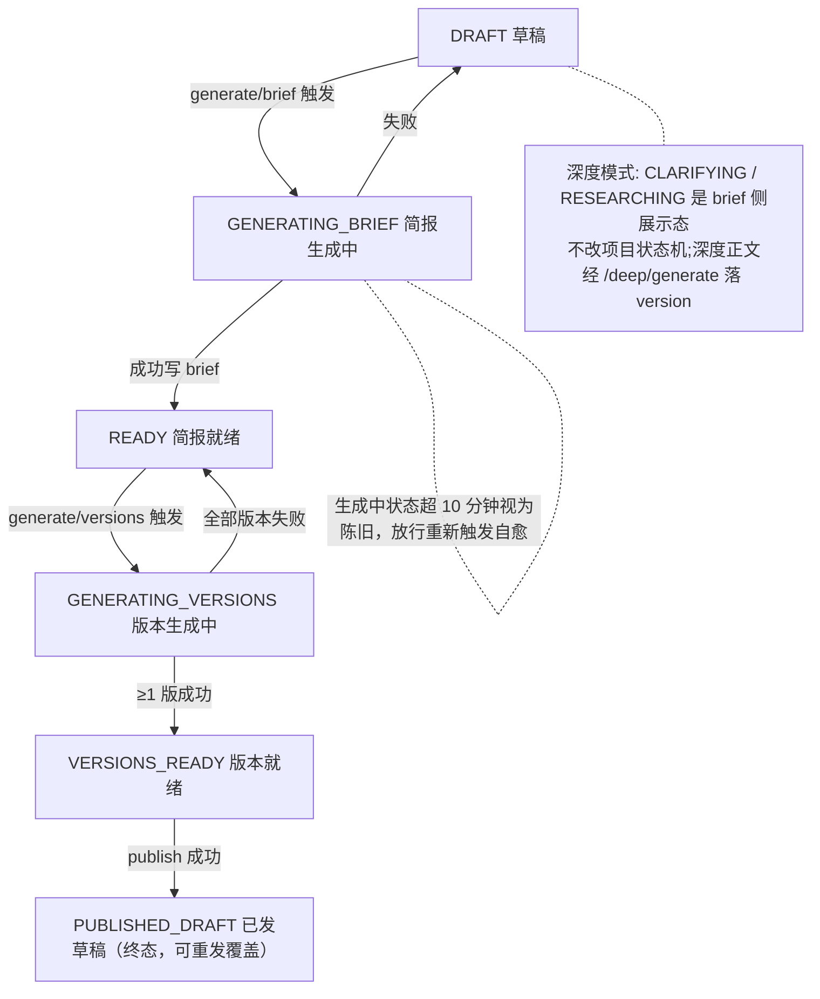

# 文章生成流程图（S0~S5 创作链路）

> 本文档为当前代码实现的流程图梳理（对应分支 `feat/project-list-enhance` 现状），
> 链路覆盖：快速模式（FAST）与深度模式（DEEP，S9 六阶段）、五步前端向导、后端服务调用、外部依赖（AI、RAG 知识库、wenyan CLI、七牛图床、wenyan-server 发布通道）。
> 权威契约见 `docs/s0-spec.md`。

---

## 1. 主流程

```mermaid
graph TD
    U["用户"] --> P0["创建项目 ProjectEdit.vue<br/>POST /api/projects<br/>未选车型时 AI 自动匹配关联车型<br/>status = DRAFT"]
    P0 -->|"gen=FAST"| STEP1
    P0 -->|"gen=DEEP 直接进深度面板"| DEEP1

    STEP1["Step 1 · 简报 StepBrief.vue"]
    STEP1 -->|"快速模式 FAST"| B1["POST /api/projects/{id}/generate/brief<br/>（前端 timeout 120s）"]
    B1 --> B2["BriefService.generate()<br/>原子抢占: DRAFT/READY → GENERATING_BRIEF<br/>生成中未过期 → 409;超 10 分钟陈旧自愈"]
    B2 --> B3["RAG 必查 CarRagService.retrieveForGeneration<br/>车型域 + KB 域同向量空间全库检索<br/>关联车型降为锚点加权<br/>状态 OK / LOW_CONFIDENCE / FAILED / NO_KNOWLEDGE"]
    B3 --> B4["AiClient.chatJson → BriefDto<br/>标题候选 / 受众 / 核心观点 / 大纲 / factRisks"]
    B4 --> B5["落 sparkora_article_brief(gen_mode=FAST)<br/>current_brief_id 指向<br/>status = READY,清 last_brief_error<br/>R3: rag_citations 引用明细随 brief 落库"]
    B5 --> B6["用户点选标题偏好<br/>PUT /{id}/selected-title"]

    DEEP1["深度模式 DEEP（S9 六阶段）"] --> D1["①② POST /deep/clarify（2026-09-11 异步化）<br/>ClarifyService.start: 真实车库名录注入<br/>同步落 PLANNING 占位(plan_status=PLANNING)立即返回 202<br/>@Async runAsync 后台 LLM 产出研究计划 + 澄清问题<br/>成功 plan_status=READY；失败删占位行 + lastBriefError"]
    D1 --> D1b["前端 StepBrief 轮询 /deep/status<br/>stage=PLANNING 显示「研究计划生成中」<br/>就绪后自动展开 ClarifyForm"]
    D1b --> D2["用户填 ClarifyForm<br/>POST /deep/clarify-answer<br/>锁定 clarify_answers"]
    D2 --> D3["③ POST /deep/run<br/>落 PENDING 占位后立即返回(202 语义)<br/>@Async runAsync 后台执行"]
    D3 --> D4["并行子代理研究（虚拟线程，≤ maxAgents）<br/>SubAgentRunner: KB 必查 + WEB（SEARXNG→Tavily 降级）<br/>逐 agent 落 research_notes<br/>PENDING→RUNNING→DONE/FAILED<br/>前端 ResearchProgress 2s 轮询 /deep/status"]
    D4 --> D5["④ FactSheetService.merge()<br/>汇总事实手册 fact_sheet"]
    D5 --> D6["自动 BriefService.generateFromFactSheet()<br/>手册为唯一事实来源生成简报字段<br/>复用同一条 DEEP brief<br/>status = READY<br/>（简报页引用面板:rag_citations + 手册 WEB/MULTI 条目合并）"]
    D6 -.自动简报失败不回滚研究产物.-> D7["POST /deep/brief 手动重试"]
    D5 -->|"跳过简报"| D8["⑤⑥ POST /deep/generate<br/>DeepWriterService: 手册+锁定需求 → 正文<br/>数值回查 verifyNumbers<br/>未收录数值 → factRisks(high) 随版本落库"]

    B6 --> STEP2
    D6 --> STEP2
    D8 --> STEP2

    STEP2["Step 2 · 版本 StepVersions.vue"] --> V1["从风格库选风格（1~10 个）<br/>POST /{id}/generate/versions<br/>（前端 timeout 300s）"]
    V1 --> V2["VersionService.generate()<br/>原子抢占: READY/VERSIONS_READY → GENERATING_VERSIONS"]
    V2 --> V3["RAG 必查（同简报，统一检索）"]
    V3 --> V4["每选一个风格生成一版<br/>AiClient.chatJson → {title, contentMd}<br/>落 sparkora_article_version<br/>label A/B/C… + styleTag + ragStatus<br/>R3: rag_citations 引用明细随版本落库"]
    V4 --> V5["默认第一版设为 currentVersionId<br/>status = VERSIONS_READY"]

    STEP3["Step 3 · 预览 + 配图 StepPreview.vue"]
    STEP2 -->|"生成成功自动跳转"| STEP3
    STEP3 --> PV1["选封面 / 正文插图<br/>图库三来源: 上传 / AI 生成 / 比亚迪同步<br/>入库即转存七牛 QiniuService"]
    PV1 --> PV2["POST /{id}/preview<br/>PreviewService: 状态校验 VERSIONS_READY|PUBLISHED_DRAFT<br/>封面+插图 → 图床公网 URL<br/>组 markdown(frontmatter title/cover + 正文）"]
    PV2 --> PV3["本机 wenyan CLI render（与发布同核）<br/>→ 公众号排版 HTML<br/>失败降级保底渲染并透传 degraded"]
    PV3 --> PV4["左栏可编辑正文<br/>PUT /{id}/versions/{versionId}/content"]

    STEP4["Step 4 · 发布 StepPublish.vue"]
    STEP3 -->|"VERSIONS_READY 解锁发布"| STEP4
    STEP4 --> PB0["GET /{id}/publish-options<br/>渲染参数默认值 + 发布通道就绪探针 publishEnabled"]
    PB0 --> PB1["POST /{id}/publish"]
    PB1 --> PB2["PublishService.publish()<br/>与预览同源渲染 previewService.preview()<br/>degraded → 中止;未设封面 → 拒绝"]
    PB2 --> PB3["组 gzhContent {title≤64字, content=HTML, cover}<br/>wenyan-server POST /upload（multipart file，x-api-key）<br/>→ fileId"]
    PB3 --> PB4["wenyan-server POST /publish {fileId}<br/>→ 微信公众号草稿箱 media_id"]
    PB4 --> PB5["原子落库:<br/>status = PUBLISHED_DRAFT（终态，可重发覆盖）<br/>publish_media_id / publish_theme / published_at"]
```

---

## 2. 项目状态机（与流程对应）

---

## 3. 关键机制

- **失败语义**：简报失败回 `DRAFT` + `lastBriefError`;版本失败（全部失败才算整体失败）回 `READY` + `lastVersionError`（部分失败仅警告）;发布失败**状态不动**只写 `lastPublishError`，可重试。
- **并发防护**：`BriefService` / `VersionService` 都用条件更新原子抢占状态（消除 check-then-set 竞态），生成中未过期拒绝重复触发，超 10 分钟视为陈旧放行自愈。`ClarifyService`（2026-09-11）以部分唯一索引 `uq_brief_planning`（同一项目至多一条 `plan_status='PLANNING'`）+ 陈旧占位清理实现同款并发/自愈，重复触发撞索引转 409。
- **事务边界**：置「生成中」短事务先提交（前端可见进度），AI 调用无事务，成功后写产物 + 推状态再提交。
- **RAG 必查降级可见**：检索失败/低置信不阻断生成，而是向 prompt 注入降级提示并强制 AI 在 `factRisks` 标注「发布前人工核实」;检索状态随 brief/version 落库（`ragStatus`）。
- **发布与预览同源**：`PublishService` 内部直接调 `previewService.preview()`，预览 HTML 即发布真值，降级 HTML 不进公众号。