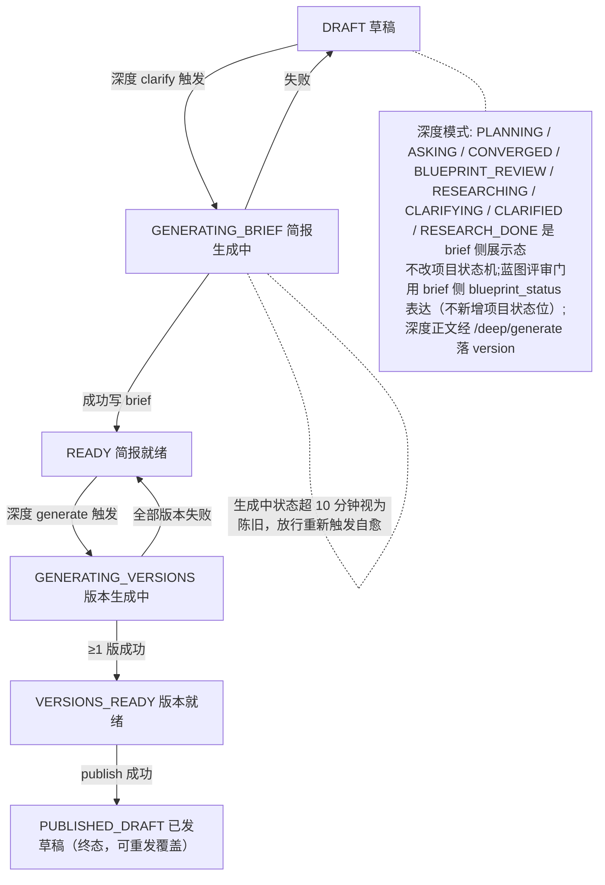

# 文章生成流程图（当前唯一深度链路 · 认知层）

> 本文档梳理**当前代码实现**的端到端创作链路流程图：唯一深度生成链路（认知层：意图澄清→研究规划→并行研究→事实手册→写作蓝图评审→写作）、四步前端向导、后端服务调用、外部依赖（AI、RAG 三域知识库、wenyan CLI、七牛图床、wenyan-server 发布通道）。
> 权威契约见 [系统说明总览](README.md) 与 `docs/spec/**`（深度链路：[spec/brief-generation.md](spec/brief-generation.md)）。
>
> **2026-09-09 说明**：快速模式（FAST）已下线——`/generate/brief`、`/generate/versions`（主题创作）保留路由但恒返回 `R.fail(410)`；本文旧版的 FAST/DEEP 双模式叙述已移除。
> **2026-10-03 说明（10-03-gen-cognitive-redesign）**：生成链路升级为认知层——澄清改多轮对话（`/deep/clarify/start|answer|converge|abort` + TaskBrief），研究规划独立（`/deep/plan`，纯事实），简报升级为写作蓝图（自动生成 + `/deep/blueprint/confirm` 人工评审门），写作按 evidenceMap 投影取用。旧一次性澄清链路（`/deep/clarify`、`/deep/clarify-answer`、`ClarifyService`、`ClarifyForm`）已退役。

---

## 1. 主流程

```mermaid
graph TD
    U["用户"] --> P0["创建项目 ProjectEdit.vue<br/>POST /api/projects<br/>status = DRAFT<br/>创建成功后 await 直发 /deep/clarify/start"]
    P0 --> D1["①② POST /deep/clarify/start<br/>ClarifyConversationService.start: 真实车库名录注入<br/>同步 LLM 生成首题 + 落 ASKING 占位(秒级)返回<br/>清理陈旧 ASKING(>10min)；撞 uq_brief_clarify_asking → 409；失败删占位"]
    D1 --> D1b["前端 ClarifyDialog 逐轮问答<br/>POST /deep/clarify/answer（或 /converge 强制收敛）<br/>缺口驱动：每轮下一问或收敛；必要槽位未填不得收敛"]
    D1b --> D2["② clarify_status=CONVERGED<br/>产出 task_brief 结构化意图契约<br/>前端 TaskBriefCard 展示"]
    D2 --> D3["③ POST /deep/plan<br/>ResearchPlannerService.plan: 基于 TaskBrief 产出纯事实 research_plan<br/>plan_status=READY（同步，8192→16384 重试）"]
    D3 --> D4["④ POST /deep/run<br/>落 PENDING 占位后立即返回（后台 @Async runAsync 执行）<br/>并行子代理研究（虚拟线程，≤ maxAgents）<br/>SubAgentRunner: KB 必查 + WEB（策略路由，默认 TAVILY_FIRST）<br/>启动即批量置全部 agent RUNNING，各 agent 独立收集器「完成即回写」<br/>前端 ResearchProgress 2s 轮询 /deep/status"]
    D4 --> D5["⑤ FactSheetService.merge()<br/>汇总事实手册 fact_sheet"]
    D5 --> D6["⑥ 自动 BriefService.generateFromFactSheet()（委托 BlueprintService.generate）<br/>TaskBrief + research_plan.hypotheses + fact_sheet → writing_blueprint<br/>blueprint_status=REVIEWING；确定性计算 coverage/gaps/quality<br/>项目状态机：GENERATING_BRIEF → READY"]
    D6 --> D6b["前端 BlueprintReview 结构化展示/编辑<br/>POST /deep/blueprint/confirm（可传编辑后 JSON）<br/>blueprint_status=CONFIRMED 解锁写作"]
    D6 -.自动蓝图失败不回滚研究产物.-> D7["POST /deep/brief 手动重试"]
    D6b --> D8["⑦ POST /deep/generate（批量异步）<br/>DeepWriterService.startBatch → @Async runBatch<br/>须 writing_blueprint 非空且 CONFIRMED（评审门）<br/>按 evidenceMap 逐节投影证据 + 数值白名单回查<br/>未收录数值 → factRisks(high) 随版本落库"]
    D7 --> D6b
    D8 --> STEP2

    STEP2["Step 2 · 版本 StepVersions.vue"] --> V3["统一 RAG 必查（CAR/KB/NEWS 三域）<br/>锚点加权 + 分层配额 + 来源标注<br/>状态 OK / LOW_CONFIDENCE / FAILED / NO_KNOWLEDGE / DISABLED"]
    V3 --> V4["每选一个风格生成一版<br/>AiClient.chatJson → {title, contentMd}<br/>落 sparkora_article_version<br/>label A/B/C… + styleTag + wordCount + ragStatus<br/>R3: rag_citations 引用明细随版本落库"]
    V4 --> V5["首版设为 currentVersionId<br/>status = VERSIONS_READY"]

    STEP3["Step 3 · 预览 + 配图 StepPreview.vue"]
    STEP2 -->|"生成成功自动跳转"| STEP3
    STEP3 --> PV1["选封面 / 正文插图<br/>图库三来源: 上传 / AI 生成 / 比亚迪同步<br/>入库即转存七牛 QiniuService"]
    PV1 --> PV2["POST /{id}/preview<br/>PreviewService: 状态校验 VERSIONS_READY|PUBLISHED_DRAFT<br/>封面+插图 → 图床公网 URL<br/>组 markdown(frontmatter title/cover + 正文）"]
    PV2 --> PV3["本机 wenyan CLI render（与发布同核）<br/>→ 公众号排版 HTML<br/>失败降级保底渲染并透传 degraded"]
    PV3 --> PV4["左栏可编辑正文<br/>PUT /{id}/versions/{versionId}/content"]

    STEP4["Step 4 · 发布 StepPublish.vue"]
    STEP3 -->|"VERSIONS_READY 解锁发布"| STEP4
    STEP4 --> PB0["GET /{id}/publish-options<br/>渲染参数默认值 + 发布通道就绪探针 publishEnabled"]
    PB0 --> PB1["POST /{id}/publish"]
    PB1 --> PB2["PublishService.publish()<br/>与预览同源渲染 previewService.preview()<br/>degraded → 中止"]
    PB2 --> PB3["组 gzhContent {title≤64字, content=HTML, cover?, author?, source_url?}<br/>wenyan-server POST /upload（multipart file，x-api-key）<br/>→ fileId"]
    PB3 --> PB4["wenyan-server POST /publish {fileId}<br/>→ 微信公众号草稿箱 media_id"]
    PB4 --> PB5["原子落库:<br/>status = PUBLISHED_DRAFT（终态，可重发覆盖）<br/>publish_media_id / publish_theme / published_at"]
```

> 说明：多版本接口 `POST /{id}/generate/versions` 对主题创作已封死（410），主题正文由深度写作 `/deep/generate` 产出（**09-27-gen-async 起为批量异步**：`styleIds[]` 一次触发、后台逐风格生成，前端轮询状态翻转）；Step 2 仅在选择深度生成时使用，风格选择随 `/deep/generate` 的 `styleIds[]` 传入。

---

## 2. 项目状态机（与流程对应）

```mermaid
graph TD
    DRAFT["DRAFT 草稿"] -->|"深度 clarify 触发"| GB["GENERATING_BRIEF 简报生成中"]
    GB -->|"成功写 brief"| READY["READY 简报就绪"]
    GB -->|"失败"| DRAFT
    READY -->|"深度 generate 触发"| GV["GENERATING_VERSIONS 版本生成中"]
    GV -->|"≥1 版成功"| VR["VERSIONS_READY 版本就绪"]
    GV -->|"全部版本失败"| READY
    VR -->|"publish 成功"| PD["PUBLISHED_DRAFT 已发草稿（终态，可重发覆盖）"]
    GB -.生成中状态超 10 分钟视为陈旧，放行重新触发自愈.- GB
    NOTE["深度模式: PLANNING / ASKING / CONVERGED / BLUEPRINT_REVIEW / RESEARCHING / CLARIFYING / CLARIFIED / RESEARCH_DONE 是 brief 侧展示态<br/>不改项目状态机;蓝图评审门用 brief 侧 blueprint_status 表达（不新增项目状态位）;<br/>深度正文经 /deep/generate 落 version"]
    DRAFT -.- NOTE
```

- FAST 已封死：`generate/brief`、`generate/versions`（主题创作）恒 `R.fail(410)`，存量 FAST 产物可读但不可再生成。
- **认知层阶段与项目状态解耦**：澄清（`ASKING`→`CONVERGED`）、研究规划（`PLANNING`→`READY`）、研究（`RESEARCHING`→`RESEARCH_DONE`）、蓝图评审（`REVIEWING`→`CONFIRMED`）都在项目 `DRAFT`/`GENERATING_BRIEF`/`READY` 内以 brief 侧字段表达；只有实际落 brief/版本时才推进项目 `status`。

---

## 3. 关键机制

- **失败语义**：澄清失败删占位不留残余；研究规划失败按截断重试一次后抛出（项目状态由 `/deep/brief` 链路回 DRAFT）；简报/蓝图失败回 `DRAFT` + `lastBriefError`；版本失败（全部失败才算整体失败）回 `READY` + `lastVersionError`（部分失败仅警告）；发布失败**状态不动**只写 `lastPublishError`，可重试。
- **并发防护**：
  - 项目状态驱动链路（`BriefService`/`VersionService`）用条件更新原子抢占状态，生成中未过期拒绝重复触发，超 10 分钟视为陈旧放行自愈。
  - C1 澄清会话以部分唯一索引 `uq_brief_clarify_asking`（同一项目至多一条 `clarify_status='ASKING'`）+ 陈旧 ASKING（>10min）物理删除实现并发/自愈，重复触发撞索引转 409。
  - 研究运行以 `runningBriefs` 集合做同 brief 互斥，重复 `/deep/run` 转 409；`run` 落占位与 `doRunAsync` 执行共用 `selectResearchWindow`，保证 question↔toolHints 索引对齐。
- **事务边界**：置「生成中」/占位短事务先提交（前端可见进度），AI 调用无事务，成功后写产物 + 推状态再提交。
- **认知层三分离**：Intent（TaskBrief，C1）/ World（research_plan 纯事实，C2）/ Domain（KB 锚点）各自独立生成与演进，不再共用一维 `keyQuestions`。
- **澄清充分性收敛**：LLM 判定 + 必要槽位（`purpose`/`audience`/`mustCover`）确定性硬兜底——任一未填则即使 LLM `converged=true` 也强制续问；`/converge` 用默认值兜底装配 TaskBrief。降级：answer 失败保留会话并回退确定性下一问；TaskBrief 两次失败按会话槽位兜底装配。
- **蓝图评审门（R5b/R6）**：蓝图生成后 `blueprint_status=REVIEWING` 暂停；用户可编辑论点/证据绑定，`POST /deep/blueprint/confirm` 置 `CONFIRMED` 才解锁写作（`DeepWriterService.startWithSpecs` 前调 `requireConfirmedBlueprint`，否则 409）。**未经确认不自动串接写作**。
- **蓝图质量信号确定性计算**：`coverage`（COVERED/PARTIAL/MISSING）与质量信号（argumentDensity/evidenceCoverage/gapCount/taskBriefConsistency）由服务层本地计算，不采用模型自由发挥值；`entryKeys` 以 `fact_sheet.entries[].key` 白名单过滤，MISSING/PARTIAL 自动入 `gaps`。
- **写作按证据映射取用（硬约束，D3）**：`DeepWriterService.write` 投影模式逐节注入该节 `evidenceMap.entryKeys` 映射的 fact 条目，蓝图未映射的事实/数值不得进正文；`coverage=MISSING/PARTIAL` 的节只允许定性陈述。数值回查升级为白名单（只拿被映射条目参与比对），蓝图外数值记 `fact_risks` high；蓝图空/解析失败/`argumentStructure` 空数组 → 退化整本手册注入，prompt 与旧实现等价。
- **RAG 必查降级可见**：检索失败/低置信不阻断生成，而是向 prompt 注入降级提示并强制 AI 在 `factRisks` 标注「发布前人工核实」；检索状态随 brief/version 落库（`ragStatus`）。契约见 [spec/retrieval.md](spec/retrieval.md)。
- **元话语三层防线**：`fact_risks` 只抽 `claim` 注入「禁止写入正文的断言」；system 追加读者视角铁律；落库前 `MetaLeakCleaner.cleanForPersist` 句级清洗（位置在数值回查之前）。见 [brief-generation.md §6](spec/brief-generation.md)。
- **发布与预览同源**：`PublishService` 内部直接调 `previewService.preview()`，预览 HTML 即发布真值，降级 HTML 不进公众号。
- **配图硬约束**：系统只产出建议，配图进入正文的唯一路径是用户在预览页显式操作（无任何自动插入开关）。见 [spec/image.md](spec/image.md)。
