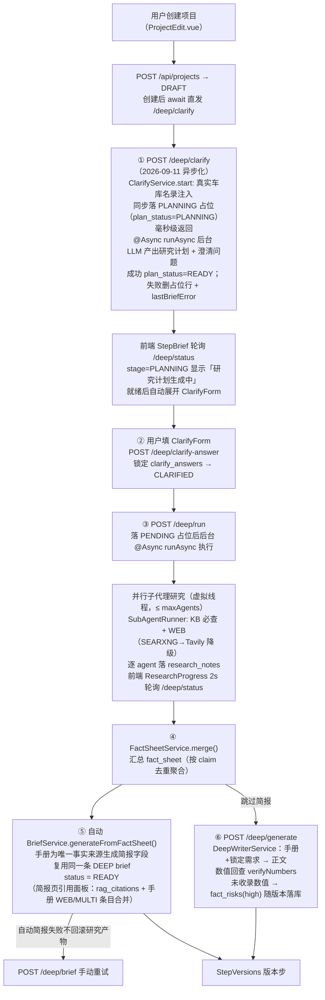

# 简报生成（深度模式 · 唯一生成链路）

> 回链：[系统说明总览](../README.md)

职责：把「主题」变成「简报」。**这是当前唯一的简报生成链路**——快速模式（FAST）已于 2026-09-09 下线（接口保留但恒 `R.fail(410)`），所有创作项目都走深度模式六阶段。

- 深度模式仅作用于 brief 层（`gen_mode=DEEP`），**项目状态机（[overview.md §4](overview.md)）不变**；`PLANNING/CLARIFYING/RESEARCHING` 为 `/deep/status` 展示态，非项目状态。
- 断点续跑：每阶段产物落库（`research_plan`→`clarify_questions`→`clarify_answers`→`research_notes`→`fact_sheet`），可从任意阶段恢复。

---

## 1. 六阶段流程

> ①理解（研究计划）→ ②一次性澄清表单 → ③并行子代理研究（KB+WEB）→ ④事实手册 → ⑤自动生成简报 → ⑥（跳过简报时）深度写作 + 数值回查。

---

## 2. 数据模型（§13，schema.sql 幂等，已同步 entity）

- `sparkora_article_brief` 增列：
  - `gen_mode TEXT DEFAULT 'FAST'`（2026-09-09 模式收敛：新 brief 恒为 DEEP，FAST 默认值仅存量语义；存量行不迁移）
  - `clarify_questions TEXT`、`clarify_answers TEXT`、`research_plan TEXT`、`research_notes TEXT`、`fact_sheet TEXT`
  - `rag_citations TEXT`（知识引用明细，见 [retrieval.md](retrieval.md)）
  - `plan_status VARCHAR(20)`（2026-09-11 clarify 异步化：DEEP 行 `PLANNING`=研究计划生成中 / `READY`=已就绪；FAST/IMITATION/存量行 null）
  - 部分唯一索引 `uq_brief_planning ON sparkora_article_brief(project_id) WHERE plan_status='PLANNING'`——同一项目同时至多一条 PLANNING，双击/双开触发的数据库级并发兜底（撞索引转 409）。
- `sparkora_article_version` 增列：`fact_risks TEXT`（数值回查结果，JSON 数组 `[{claim,riskLevel,suggestion}]`）、`rag_citations TEXT`（知识引用明细，见 [version-generation.md](version-generation.md)）。
- `sparkora_article_brief.style_recommendations TEXT`（仅 `gen_mode=IMITATION` 使用，见 [imitation.md](imitation.md)）。

---

## 3. 接口契约

全部 `R<T>` 包装；方法级 `@PreAuthorize`；前缀 `/api/projects/{projectId}/deep`。

| 方法 | 路径 | 权限 | 请求 | 响应 |
|---|---|---|---|---|
| POST | `/deep/clarify` | ADMIN/EDITOR | `{topic(必填), extraInfo?}` | **2026-09-11 异步化**：`{briefId, stage:"PLANNING"}`，毫秒级返回（不再携带计划内容）；同步落 PLANNING 占位 brief(`gen_mode=DEEP`)，后台 `@Async` 生成研究计划与澄清问题，成功回写 plan/questions + `plan_status=READY`；失败删除占位行 + 写 `project.last_brief_error`。并发/陈旧冲突 → `R.fail(409,...)` |
| POST | `/deep/clarify-answer` | ADMIN/EDITOR | `{briefId, answers:{问题:答案}}` | `{briefId, locked}`（锁定 JSON 落库） |
| POST | `/deep/run` | ADMIN/EDITOR | `{briefId}` | `{briefId, agents, done}`（同步阻塞；前端轮询 status） |
| POST | `/deep/generate` | ADMIN/EDITOR | `{briefId, styleId?}`（09-10-style-library-enhance：`styleId` 优先，后端回查风格表取 `toneGuidance`/`name` 注入 system prompt；查无 → 400「风格不存在或已删除」；旧 `stylePrompt`/`styleName` 保留兼容，deprecated） | `{versionId}`（版本 `fact_risks` 落库；09-10-versions-page-fix：落版本补齐 `title`/`version_label`/`style_tag`/`word_count`，成功后推进状态机 READY→VERSIONS_READY、首版设 current（追加不覆盖）） |
| POST | `/deep/brief` | ADMIN/EDITOR | `{briefId}` | `ArticleBriefEntity`（基于事实手册生成简报，落同一条 DEEP brief 行并推状态机到 READY；研究完成后自动触发一次，此处为手动重试入口；409=状态冲突） |
| GET | `/deep/status` | 三角色 | `?briefId`（缺省取最新 DEEP brief） | `{briefId, genMode, stage, planStatus, researchPlan?, questions?, answers?, agents?, factSheet?, toolHealth:{KB,SEARXNG,TAVILY}}` |

- stage 判定（brief 层展示态）：`PLANNING`（`plan_status=PLANNING`，clarify 占位生成中，2026-09-11 新增，优先于其余判定）> `RESEARCH_DONE`（`fact_sheet` 非空）> `RESEARCHING`（`research_notes` 非空）> `CLARIFIED`（`answers` 非空）> `CLARIFYING`（`questions` 非空）> `NONE`。
- toolHealth（2026-09-15 契约升级，值由布尔改状态码 `OK|DISABLED|UNCONFIGURED|FAILED`）：
  - `KB` = `kb_enabled ? OK : DISABLED`（反映设置页运行时门控，不再恒 true）。见 [settings.md](settings.md)。
  - `SEARXNG`/`TAVILY` 先判 `SEARCH_WEB_ENABLED && webSearchEnabled`（false → `DISABLED`），再按 `configured()`（密钥/地址就绪）→ `UNCONFIGURED`、`lastCallOk()`（最近一次调用健康态，初值乐观）→ `FAILED`/`OK`。
  - 优先级 `DISABLED > UNCONFIGURED > FAILED > OK`。前端未拿到该字段时渲染 `--`（未知态，不谎报可用）。
- 权限冒烟：viewer 访问写接口 403（`hasAnyRole('ADMIN','EDITOR')`）。

> 轮询注意：前端轮询必须携带**本次启动返回的 briefId** 精确定位（占位行失败被删后按 projectId 取最新会回退到更早旧行，误判状态）。

---

## 4. 工具层（SearchTool 抽象，`com.sparkora.deep.tool`）

| 工具 | 实现 | 来源 | 降级语义 |
|---|---|---|---|
| KB | `KnowledgeSearchTool` | 委托 `CarRagService.retrieveForGeneration` 统一检索（[knowledge/kb.md](knowledge/kb.md)，S8） | 异常 warn，不抛出 |
| SEARXNG | `SearxngSearchTool` | GET `{SEARXNG_BASE_URL}/search?q=&format=json&language=zh-CN` | 超时/空结果静默空列表 + `lastCallOk()=false`（仅供健康展示）；`available()` 仅判地址就绪，失败不闩锁 |
| TAVILY | `TavilySearchTool` | POST `api.tavily.com/search` `{api_key,query,max_results,search_depth}` | 密钥未配置 → `available()/configured()=false`；调用失败仅置 `lastCallOk()=false`，下次研究自动重试 |

- WEB 选择顺序：SEARXNG → Tavily（拿到结果即止）；每子代理 `webQuota=max(1, 8/n)`，`SEARCH_WEB_ENABLED=false` 时为 0（纯 KB）。
- **KB 锚点感知检索（R1，2026-09-06）**：`KnowledgeSearchTool.search(query, maxResults, anchors)` 委托 `retrieveForGeneration`（锚点加权 + 参数级子查询 + 核心块/权益块分层配额）；锚点由 `DeepResearchService.resolveAnchors` 解析（项目关联车型为准 → `CarModelMatcherService` 按主题识别兜底，失败不阻断）；子代理 KB 检索 query 用「主题 + 问题」复合语料（纯问题如「价格对比」缺车型上下文相似度必散）。非 OK 状态返回空列表归 gaps（行为同旧）。
- **WEB gap 驱动（R1 同批）**：KB 已命中车型域权威块（命中含 MODEL_INFO/价格区间文本）时跳过 WEB 补查——WEB 只补 KB 缺口，不与 KB 平行全问题重搜、不得覆盖 KB 结论。
- **同 claim 冲突裁决（R2，2026-09-06）**：`FactSheetService.merge` 聚合时同 claim 同时含 KB 与 WEB 来源 → **KB 胜出**（不比较相似度/置信度，量纲不同不可比；按来源身份定优先级：本系统知识库（比亚迪同步清洗）> 外部 WEB）。WEB 条目降级为该条目 `alternatives`（URL 列表）留证据，并写 warnings「以知识库为准；外部来源(N 条)有异说,未采用」。纯 KB / 纯 WEB 条目维持原置信规则（KB 0.9 / 多源交叉 0.85 / 单一 WEB 0.4 + 待核实）。
- `SearchHit.web(type=工具名→展示源)`：type 统一为 `WEB`（计数依据），工具名记 `modelName` 字段。
- 密钥链：`DEEP_TAVILY_API_KEY`(System property/env) → `TAVILY_API_KEY` → `sparkora.deep.tavily-api-key`（`DeepProperties` 绑定前缀 `sparkora.deep`，2026-09-15 修正；dotenv 注入 System property，嵌套占位符 `${A:${B:}}` Spring 不支持，故 yml 只挂 `TAVILY_API_KEY`）。

---

## 5. 研究笔记 / 事实手册结构

- `research_notes`：`[{agentId, question, status(DONE/FALLBACK/FAILED), factsJson, webCount}]`；`factsJson`=`{facts:[{claim,value,source:{type:"KB|WEB",url,modelName,docId},confidence}],gaps:[...]}`。
- `fact_sheet`（`FactSheetService.merge`，按 claim 去重聚合）：`{entries:[{key,claim,value,sources:{type,url,modelName,docId},crossCount,confidence}],gaps:[...],warnings:[...]}`。
- 置信度规则：多源交叉(≥2) 0.85 交叉标注 / KB 0.9 / 单一 WEB 0.4 + warnings「仅单一 WEB 源,待核实」/ 冲突 0.3。
- 已知限制：WEB 命中为摘要级（snippet），不做正文抓取；低置信条目以 warnings 提示人工核实。

---

## 6. 深度写作与数值回查

- `DeepWriterService.write`：`fact_sheet` 条目进 prompt + 铁律「数值必须逐字出自手册」→ `AiClient.chat`（非 JSON 方法）→ 落 version（复用版本链路，见 [version-generation.md](version-generation.md)）。
- 数值回查（正则，0 次 LLM）：抽取正文数值（万/千分位/百分比/带单位 `km|kWh|kW|mm|L/100km|s`）与手册比对，手册外数值 → `fact_risks` `[{claim,riskLevel:"high",suggestion:"发布前必须人工核实或删除"}]` 落版本字段。
- 2026-09-04 实测：version 1917 字符，捕获手册外「25万」high 1 条。

---

## 7. 前端（`views/project/deep/` 四组件 + StepBrief 深度分支）

- 反问题型：`input` / `single`（radio）/ `multi`（checkbox，车型锚点多选；提交时以「、」拼接、回显时按「、」还原数组）。`ClarifyForm` 支持全部三型（2026-09-05 增补 multi）。
- **反问必须基于车库名录（2026-09-05 修复）**：`ClarifyService` 注入 `CarModelService.list()` 名录（名称+价格区间）进 prompt；规则：车型/竞品/对比类问题的 options 只能从名录选、不得编造；主题指向某款/某系列车型时必须有一道 multi 锚点车型题（options 覆盖名录中含该系列词的全部车型）。车库获取失败降级为不注入并提示不编造车型。
- **竞品对比题强制多选（R1，2026-09-05）**：prompt 明确「对比/竞品/比较/竞对类问题 `type=multi`（选项 2~4 个竞品 + 「不对比」兜底）」；后端 `ClarifyService.normalizeQuestions` 确定性归一化兜底（不依赖 LLM 遵守）：问题文本含竞品信号词（对比/竞品/比较/竞对/竞争）的选项题强制 `type=multi` 并补「不对比」选项（缺省时）；无选项的竞品题归 `input`（自由填写）；解析失败原样保留不阻断。
- **「其他(自行填写)」（R2，2026-09-05）**：`ClarifyForm.vue` 对 single/multi 题渲染「其他(自行填写)」入口——single 选中后切文本框（提交取文本框内容），multi 勾选后文本并入答案（「、」拼接）；锁定回显时不在 options 中的答案自动归「其他」并回填。
- 组件：`DeepPlanCard`（研究计划）/`ClarifyForm`（生成↔锁定回显两态）/`ResearchProgress`（2s 轮询 status + 工具健康行 toolHealth 徽标）/`FactSheetSummary`（手册摘要 + 来源徽标 KB 蓝/WEB 紫 + 置信度条 + gaps/warnings）。
- **研究完成 → 自动生成简报（2026-09-05 修复）**：`DeepResearchService.runAsync` 落 `fact_sheet` 后自动调 `BriefService.generateFromFactSheet`（LLM 一次，以事实手册为唯一事实来源 + 锁定需求 → 简报五字段落同一条 DEEP brief 行，`currentBriefId` 指向该行，状态机 GENERATING_BRIEF→READY）；失败不回滚研究产物（回 DRAFT + `lastBriefError`，深度面板可手动重试 `/deep/brief`，也可「跳过简报直接生成正文」）。修复「确定研究计划/研究完成后没有简报页面」的结构性缺陷。
- `StepBrief.vue`（2026-09-11 单一状态机收敛，09-11-brief-gen-flow-refactor）：**无 FAST/DEEP 模式切换**——唯一生成路径为深度流程，无简报区间由唯一 `deepStage` 状态机驱动（值域 `NONE|PLANNING|CLARIFYING|CLARIFIED|RESEARCHING|RESEARCH_DONE`），同一状态恒渲染同一 UI，与进入路径（创建直发/重新进入/仅存草稿）无关；**删除 `deepMode` 路径意图布尔与 6s 有界重探测**。project 就位后 `syncDeepStatus()` 单次拉 `/deep/status` 断点恢复（PLANNING 则续起 2.5s 自轮询），不再依赖 `?gen=deep`。「重新研究生成」直接 `startDeep()` 进 PLANNING（`restarting` 标志跳过旧简报正文分支，新简报落库后恢复）。无简报区间只保留**一个**主操作「开始深度研究」，删除「开始深度研究→生成研究计划」两步链与裸生成按钮。CLARIFYING/RESEARCHING 仅 brief 展示态，项目状态机不变（`constants/project.js` 注释）。RESEARCH_DONE 态下简报正常展示（自动简报完成即 READY）；失败显示「重新生成简报」+「跳过简报,直接生成正文」。`ragStatus` 展示含 `DISABLED`（知识库已停用·全局设置，灰，见 [retrieval.md](retrieval.md)）。
- 移动端：单列纵排、抽屉全屏、触控 ≥44px。

---

## 8. 配置（.env.example 已同步）

| 变量 | 默认 | 说明 |
|---|---|---|
| `SEARCH_WEB_ENABLED` | `true` | WEB 搜索总开关（SEARXNG+Tavily） |
| `TAVILY_API_KEY` / `DEEP_TAVILY_API_KEY` | 空 | Tavily 密钥（`.env`；`DEEP_` 前缀可覆盖） |
| `SEARXNG_BASE_URL` | `http://localhost:5676` | SEARXNG 实例（本机/内网部署，2026-09-04 迁移至 192.168.3.108:5676） |
| `CRAWL4AI_BASE_URL` | 空 | 预留：正文抓取工具未接入（摘要级搜索的后续增强） |
| `DEEP_RESEARCH_TIMEOUT_MS` | `120000` | 单子代理超时（futures.get 兜底，超时→FAILED+gap） |
| `DEEP_MAX_AGENTS` | `4` | 子代理数上限（虚拟线程 per-task executor） |

---

## 9. 关键实现路径

- 后端：`com.sparkora.deep.service.*`（`ClarifyService`/`DeepResearchService`/`FactSheetService`/`SubAgentRunner`/`DeepWriterService`）、`com.sparkora.deep.tool.*`（`SearchTool` 抽象 + KB/SEARXNG/TAVILY 实现）、`com.sparkora.web.controller.DeepController`、`com.sparkora.service.BriefService.generateFromFactSheet`、`config.DeepProperties`。
- 前端：`views/project/StepBrief.vue`、`views/project/deep/{DeepPlanCard,ClarifyForm,ResearchProgress,FactSheetSummary,CitationList}.vue`。
- 表：`sparkora_article_brief`（深度字段）、`sparkora_article_version`（`fact_risks`）。

---

## 10. 验收状态（2026-09-04）

- [x] AC1 深度模式端到端（项目20/briefId=18：clarify 5 问→锁定→run agents=4 done=4→fact_sheet→generate versionId=16）
- [x] AC2 并行研究：4 虚拟线程子代理并行，全部 DONE（首次 run 因 toolHints 序列化 bug 全 KB，修复后 webCalls=5/6）
- [x] AC3 WEB 来源进手册：fact_sheet 6 条含 2 条 WEB（海狮08 22.99万起/海狮06 12.99-19.98万），置信度 4×0.9+2×0.4，warnings 4 条
- [x] AC4 写作+数值回查：version 1917 字符；fact_risks 捕获手册外「25万」riskLevel=high
- [x] AC5 快速模式回归：项目21（FAST brief id=19 + version id=17/18）全通过，深度/快速互不影响（**注：快速模式已于 2026-09-09 下线，此条为历史快照**）
- [x] AC6 `mvn test-compile surefire:test` 44 全绿；`npx vite build` 绿（48s）
- [ ] AC7 研究过程可视化 UI 真机走查（计划→表单→进度→手册→生成）→ **留用户浏览器验收**

---

## 11. 已知限制

- WEB 命中为摘要级（snippet），不做正文抓取（`CRAWL4AI_*` 未接入）。
- 低置信条目以 `warnings` 提示人工核实，不自动剔除。
- 快速模式已下线，其回归条目仅为历史记录。
