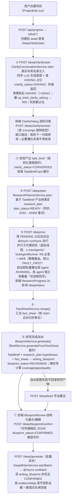

# 简报生成（深度模式 · 认知层）

> 回链：[系统说明总览](../README.md)

职责：把「主题」经「意图澄清（多轮对话）→ 纯事实研究规划 → 并行研究 → 事实手册 → 写作蓝图（人工评审门）」变成**可写作的蓝图**。**这是当前唯一的简报生成链路**——快速模式（FAST）已于 2026-09-09 下线（接口保留但恒 `R.fail(410)`，提示改用 `/deep/clarify/start`），所有创作项目都走深度模式认知链路。

- 深度模式仅作用于 brief 层（`gen_mode=DEEP`），**项目状态机（[README.md §4.2](../README.md)）不变**；`PLANNING/ASKING/CONVERGED/BLUEPRINT_REVIEW/RESEARCHING` 等为 `/deep/status` 展示态，非项目状态。
- 断点续跑：每阶段产物落库（`clarify_session`→`task_brief`→`research_plan`→`research_notes`→`fact_sheet`→`writing_blueprint`），可从任意阶段恢复。
- **认知层三分离**（10-03-gen-cognitive-redesign 设计原则）：Intent（用户意图，C1 澄清）/ World（外部事实，C2 研究规划）/ Domain（领域约束，KB 锚点）各用一套机制，不再混装。旧的一次性定长表单与 `clarify_questions` 混装链路已退役。

---

## 1. 认知层流程

> ① 意图澄清多轮对话 → ② 结构化 TaskBrief → ③ 纯事实研究规划 → ④ 并行子代理研究（KB+WEB）→ ⑤ 事实手册 → ⑥ 写作蓝图自动生成（REVIEWING）→ ⑦ 人工确认（CONFIRMED）解锁写作。


```mermaid
graph TD
    U["用户创建项目（ProjectEdit.vue）"] --> C0["POST /api/projects → DRAFT<br/>创建后 await 直发 /deep/clarify/start"]
    C0 --> D1["① POST /deep/clarify/start<br/>ClarifyConversationService.start: 真实车库名录注入<br/>同步 LLM 生成首题 + 落 ASKING 占位（clarify_status=ASKING）秒级返回<br/>清理陈旧 ASKING（&gt;10min）；撞 uq_brief_clarify_asking → 409；失败删占位"]
    D1 --> D1b["前端 ClarifyDialog 逐轮问答<br/>POST /deep/clarify/answer（或 /converge 强制收敛）<br/>缺口驱动：每轮下一问或收敛；必要槽位未填不得收敛"]
    D1b --> D2["② 收敛产出 task_brief（结构化意图契约）<br/>clarify_status=CONVERGED<br/>前端 TaskBriefCard 展示"]
    D2 --> D3["③ POST /deep/plan<br/>ResearchPlannerService.plan: 基于 TaskBrief 产出纯事实 research_plan<br/>plan_status=READY（同步，8192→16384 重试）"]
    D3 --> D4["④ POST /deep/run<br/>落 PENDING 占位后后台 @Async runAsync 执行<br/>并行子代理研究（虚拟线程，≤ maxAgents）<br/>SubAgentRunner: KB 必查 + WEB（策略路由，默认 TAVILY_FIRST）<br/>启动即批量置全部 agent RUNNING，各 agent 独立收集器「完成即回写」<br/>前端 ResearchProgress 2s 轮询 /deep/status"]
    D4 --> D5["⑤ FactSheetService.merge()<br/>汇总 fact_sheet（按 claim 近似归并聚合）"]
    D5 --> D6["⑥ 研究完成自动 BlueprintService.generate()<br/>（BriefService.generateFromFactSheet 委托）<br/>TaskBrief + research_plan.hypotheses + fact_sheet → writing_blueprint<br/>blueprint_status=REVIEWING；确定性计算 coverage/gaps/quality"]
    D6 --> D7["⑦ 前端 BlueprintReview 结构化展示/编辑<br/>POST /deep/blueprint/confirm（可传编辑后 JSON）<br/>blueprint_status=CONFIRMED 解锁写作"]
    D6 -->|"自动蓝图失败不回滚研究产物"| D7b["POST /deep/brief 手动重试"]
    D7 --> W["POST /deep/generate（批量异步）<br/>DeepWriterService.startBatch → @Async runBatch<br/>须 writing_blueprint 非空且 CONFIRMED<br/>按 evidenceMap 逐节投影证据 + 数值白名单回查"]
    D7b --> D7
```

---

## 2. 数据模型（Flyway `db/migration/`，已同步 entity）

`sparkora_article_brief`（`V1__baseline.sql` 建表/基础列）：

- `gen_mode VARCHAR(10) DEFAULT 'FAST'`（2026-09-09 模式收敛：新 brief 恒为 DEEP，FAST 默认值仅存量语义；存量行不迁移）
- `research_plan TEXT`、`research_notes TEXT`、`fact_sheet TEXT`、`rag_citations TEXT`（知识引用明细，见 [retrieval.md](retrieval.md)）
- `plan_status VARCHAR(20)`（研究计划态：`READY`=已就绪；`PLANNING`=异步生成中占位，**当前 `/deep/plan` 已同步，正常不再出现**，`stageOf` 仍兼容存量/并发占位）
- `research_reasoning TEXT`（10-02-brief-reasoning-maxtokens：研究计划阶段 AI 思考过程，经 `/deep/status` 的 `planReasoning` 增量透出；非推理模型/历史行为 null）
- 部分唯一索引 `uq_brief_planning ON sparkora_article_brief(project_id) WHERE plan_status='PLANNING'`（存量并发兜底，见 V1 基线）
- **历史遗留列**：`clarify_questions TEXT`、`clarify_answers TEXT`（旧一次性表单链路产物）。新认知链路**不再写入**；仅存量行保留、`/deep/status` 与 `/deep/run` 对其向后兼容（见 §3.2/§3.9）。

`V10__cognitive_layer.sql`（C1）新增：

- `clarify_session TEXT` — 多轮澄清会话 JSON（§3.4）
- `task_brief TEXT` — 结构化意图契约 JSON（§3.5）
- `clarify_status VARCHAR(20)` — `ASKING`/`CONVERGED`/`ABORTED`
- 部分唯一索引 `uq_brief_clarify_asking ON sparkora_article_brief(project_id) WHERE clarify_status='ASKING'`——同一项目同时至多一条进行中会话，双击/双开触发的数据库级并发兜底（撞索引转 409）。

`V11__writing_blueprint.sql`（C3）新增：

- `writing_blueprint TEXT` — 写作蓝图 JSON（§3.7）
- `blueprint_status VARCHAR(20)` — 人工评审门态 `REVIEWING`/`CONFIRMED`（仅 DEEP 链路；不新增项目状态位）
- `blueprint_quality TEXT` — 质量信号 JSON（§3.8）

`sparkora_article_version` 增列：`fact_risks TEXT`（数值回查结果，JSON 数组 `[{claim,riskLevel,suggestion}]`）、`rag_citations TEXT`（知识引用明细，见 [version-generation.md](version-generation.md)）。

`sparkora_article_brief.style_recommendations TEXT`（仅 `gen_mode=IMITATION` 使用，见 [imitation.md](imitation.md)）。

---

## 3. 接口与认知层契约

全部 `R<T>` 包装；方法级 `@PreAuthorize`（写接口 ADMIN/EDITOR，`/deep/status` 三角色）；前缀 `/api/projects/{projectId}/deep`。

> **Boot 4 Jackson 版本边界（务必遵守）**：MVC 层响应由 **Jackson 3(tools.jackson)** 序列化（`spring.jackson.*`），业务层注入的 **Jackson 2** `ObjectMapper`（`spring-boot-jackson2`）仅用于内部 JSON 拼装。**控制器返回的 `Map` 里绝不能放 Jackson 2 的 `JsonNode`/`ObjectNode` 树节点**——Jackson 3 不识别该类型会退化为反射 bean 序列化，吐出 `{array:false,object:true,nodeType:...}` 元数据而非真实 JSON。`ClarifyConversationService.start/answer/converge` 的 `question`/`session`/`taskBrief` 因此统一经 `nodeToValue(JsonNode)`（`json.convertValue(n, Object.class)`）转为纯 `Map`/`List` 再返回；`/deep/status` 返回的 `clarifySession`/`taskBrief`/`writingBlueprint` 均为**字符串列**故无此问题。新增返回树节点的接口须照此转换（否则单测以 MockMvc 的 Jackson 也可能同样暴露元数据）。

### 3.1 接口总表

| 方法 | 路径 | 请求 | 响应 |
|---|---|---|---|
| POST | `/deep/clarify/start` | body 可空（忽略，主题/内容描述/读者/字数一律从项目实体读） | `{briefId, stage:"ASKING", question, session}`；同步 LLM 生成首题并落 `clarify_status=ASKING` 占位。并发/撞 `uq_brief_clarify_asking` → 409；LLM 失败删占位不留残余 |
| POST | `/deep/clarify/answer` | `{briefId, questionId, answer}` | `{briefId, converged, question?, taskBrief?, session}`；追加回合 + 落定本轮槽位，LLM 判下一问/收敛。必要槽位硬兜底（未填即使 LLM `converged=true` 也强制续问）；问题已过期 → 409；状态非 ASKING → 409 |
| POST | `/deep/clarify/converge` | `{briefId}` | `{briefId, taskBrief}`；强制收敛，必要槽位缺则用已有信息 + 默认值（`source=DEFAULT`）装配。已 CONVERGED 幂等返回；ABORTED/不存在 → 409/400 |
| POST | `/deep/clarify/abort` | `{briefId}` | `{briefId, status:"ABORTED"}`；`clarify_status=ABORTED`，幂等 |
| POST | `/deep/plan` | `{briefId}` | `ArticleBriefEntity`（已回写 research_plan）；基于 TaskBrief 产出**纯事实**研究计划并置 `plan_status=READY`。`task_brief` 空 → 409；8192→16384 重试一次 |
| POST | `/deep/run` | `{briefId}` | `{briefId, agents, started:true, strategy, webProviderOrder}`；同步校验 + 落 PENDING 占位后立即返回，后台 `@Async` 执行。前置：brief 属路径项目、`gen_mode=DEEP`、澄清已完成（`task_brief` 非空，**兼容存量 `clarify_answers` 非空**）否则 400；`plan_status=PLANNING`、研究计划无 keyQuestions → 409；同一 brief 已在研究中 → 409 |
| POST | `/deep/generate` | `{briefId, styleIds:[...]}`（兼容单 `styleId`/旧 `stylePrompt`/`styleName`，deprecated） | `{status:"GENERATING_VERSIONS", styleCount:N}` 毫秒级占位，后台 `@Async` 逐风格生成。**须 `writing_blueprint` 非空且 `blueprint_status='CONFIRMED'`，否则 409「写作蓝图尚未确认…」**（评审门，见 §3.7/§6） |
| POST | `/deep/blueprint/confirm` | `{briefId, writingBlueprint?}`（`writingBlueprint` 可空；非空为人工编辑后蓝图 JSON） | `ArticleBriefEntity`；置 `blueprint_status=CONFIRMED` 解锁写作。`writing_blueprint` 空（从未生成）→ 409；幂等；带编辑且含 `evidenceMap` 时以事实手册白名单**重算** coverage/gaps/quality |
| POST | `/deep/brief` | `{briefId}` | `ArticleBriefEntity`；基于事实手册生成写作蓝图（研究完成后后端自动触发一次，此处为手动重试入口）；409=状态冲突 |
| GET | `/deep/status` | `?briefId`（缺省取最新 DEEP brief） | 见 §3.9 |

### 3.2 stage 判定（brief 层展示态，首个命中即返回）

`PLANNING`（`plan_status=PLANNING`，存量异步占位）> `BLUEPRINT_REVIEW`（`writing_blueprint` 非空；须先于 RESEARCH_DONE，研究完成后 fact_sheet 与蓝图并存）> `ASKING`（`clarify_status=ASKING`）> `CONVERGED`（`clarify_status=CONVERGED` 且 `research_plan` 空）> `RESEARCH_DONE`（`fact_sheet` 非空）> `RESEARCHING`（`research_notes` 非空）> `CLARIFIED`（存量 `clarify_answers` 非空）> `CLARIFYING`（存量 `clarify_questions` 非空）> `NONE`。

> 注：`BLUEPRINT_REVIEW` 在 `blueprint_status` 为 `REVIEWING` 或 `CONFIRMED` 时都命中（已确认但未写作时仍展示评审面板）；前端另据 `blueprintStatus` 区分「待确认/已确认」。

### 3.3 toolHealth / webStrategy（增量）

- `toolHealth`（2026-09-15 契约升级，值由布尔改状态码 `OK|DISABLED|UNCONFIGURED|FAILED`）：
  - `KB` = `kb_enabled ? OK : DISABLED`（反映设置页运行时门控）。见 [settings.md](settings.md)。
  - `SEARXNG`/`TAVILY`/`SERPER`（10-04-serper-provider A 增量）先判 `SEARCH_WEB_ENABLED && webSearchEnabled`（false → `DISABLED`），再按 `configured()` → `UNCONFIGURED`、`lastCallOk()` → `FAILED`/`OK`。`SERPER` 未配置时 `UNCONFIGURED`（与 Tavily 同理），既有三键值域不变。
  - 优先级 `DISABLED > UNCONFIGURED > FAILED > OK`。前端未拿到该字段时渲染 `--`（未知态，不谎报可用）。
  - `webStrategy`（09-25 增量；10-04 扩为三值）：有效策略标签 `TAVILY_FIRST`/`SEARXNG_FIRST`/`PRIMARY_FANOUT`（顺序含 `SERPER` 时回落此标签）；`webProviderOrder` 为规范化 provider 串。**配置就绪不等于已验证可用**——以 agents[].search 实际调用为准。
- 权限冒烟：viewer 访问写接口 403（`hasAnyRole('ADMIN','EDITOR')`）。

### 3.4 `clarify_session` JSON（C1）

```json
{
  "status": "ASKING|CONVERGED|ABORTED",
  "converged": false,
  "slots": [
    { "id": "purpose", "label": "写作目的", "value": "…", "source": "USER", "confidence": 1.0, "done": true }
  ],
  "turns": [
    { "idx": 1, "questionId": "purpose", "question": "这篇文章主要写给谁看？", "answer": "…", "at": "2026-10-03T…" }
  ],
  "currentQuestion": { "id": "audience", "text": "…", "type": "single", "options": ["…"], "required": true, "slotId": "audience" },
  "reasoning": "为什么问这题/为什么收敛（可选）"
}
```

- `currentQuestion` 收敛/中止后为 `null`（null node）。
- 多值槽位（`angles`/`mustCover`/`mustAvoid`）的 `value` 为字符串数组；标量为字符串。
- `source` ∈ `USER|PICKED|DEFAULT|INFERRED`（选项命中=PICKED，自由输入=USER；白名单外归 INFERRED）；`confidence` 截到 `[0,1]`。
- `turns[].idx` 从 1 递增（取 `turns.size()`，首回合为 1）；`questionId` 为空串表示模型未给稳定 id。
- 解析容错：畸形/空 `clarify_session` → 回退空会话（不抛）。

### 3.5 `task_brief` JSON（C1）

```json
{
  "purpose":       { "value": "…", "source": "USER", "confidence": 1.0 },
  "audience":      { "value": "…", "source": "PICKED", "confidence": 0.8 },
  "tone":          { "value": "…", "source": "INFERRED", "confidence": 0.5 },
  "angles":        [ { "value": "…", "source": "INFERRED", "confidence": 0.4 } ],
  "mustCover":     [ { "value": "…", "source": "USER", "confidence": 1.0 } ],
  "mustAvoid":     [ { "value": "…", "source": "USER", "confidence": 1.0 } ],
  "successCriteria": { "value": "…", "source": "DEFAULT", "confidence": 0.2 },
  "lengthTarget":  { "value": "1500", "source": "PICKED", "confidence": 1.0 },
  "slotMeta":      [ { "id": "purpose", "filled": true, "source": "USER" } ]
}
```

- 全部 8 槽位：`purpose`/`audience`/`tone`/`angles`/`mustCover`/`mustAvoid`/`successCriteria`/`lengthTarget`（顺序即展示序）。
- **必要槽位**（硬兜底）：`purpose`/`audience`/`mustCover`。任一未填不得收敛；`/converge` 时用默认文案兜底（`source=DEFAULT`、`confidence=0.2`）。
- 装配规则：会话槽位存在 → 用其 `source/confidence`；缺失但 LLM TaskBrief 给了值 → `source=DEFAULT`、`confidence=0.4`；仍缺且非必要 → 空串/空数组。
- `slotMeta[].filled` 表示会话槽位是否有值（供前端进度）。
- **下游唯一输入**：研究规划（§3.6）与写作蓝图（§3.7）只读 `task_brief`，不再读旧 `clarify_answers` 拼接文本。

### 3.6 `research_plan` JSON（C2，纯事实）

```json
{
  "keyQuestions": ["…（仅事实/世界维度，3~7 条）"],
  "dataNeeds": ["价格/尺寸/竞品参数"],
  "hypotheses": ["可被研究推翻的初步假设"],
  "toolHints": [ { "question": "与 keyQuestions 一一对应", "tools": ["KB", "WEB"] } ]
}
```

- `ResearchPlannerService.plan` 基于 TaskBrief + 项目信息生成；`ResearchPlanDto` **刻意不含任何意图/澄清字段**。
- 确定性兜底 `ensureBackgroundQuestion`（C2 自旧 `ClarifyService` 逐字迁移）：主题/内容描述命中背景信号词（发布/宣布/建成/落成/完成/启用/战略/计划/规划/政策/里程碑/首个/突破/布局/进军）且现有问题无背景型检测词（背景/战略/规划/目标/意义/来龙去脉/发展历程/布局/为什么/如何演变）时，追加一条背景题并同步补 `toolHints`（保证问题:提示 1:1）；幂等、异常静默降级。
- LLM 调用 8192→16384 重试一次；成功后置 `plan_status=READY`、回写 `research_reasoning`（非空时）、`ai_model`/`token_usage`。

### 3.7 `writing_blueprint` JSON（C3）与评审门

```json
{
  "thesis": "中心论点一句话",
  "audienceAngle": "面向目标读者的切入角度",
  "narrativeArc": "读者认知路径（问题→张力→解答→行动）",
  "argumentStructure": [
    { "sectionId": "S1", "heading": "…", "role": "HOOK|CONTEXT|ARGUMENT|EVIDENCE|COUNTER|CONCLUSION",
      "claim": "分论点", "narrativeIntent": "…", "argumentRelation": "支撑 thesis / 回应 S2" }
  ],
  "evidenceMap": [
    { "sectionId": "S1", "argument": "分论点", "evidenceNeeded": "所需证据类型",
      "entryKeys": ["f_123", "f_456"], "coverage": "COVERED|PARTIAL|MISSING", "note": "…" }
  ],
  "constraints": ["合规红线/必避"],
  "gaps": [ { "sectionId": "S3", "reason": "所需证据未在事实手册中找到" } ],
  "quality": { "argumentDensity": 4, "evidenceCoverage": 0.75, "gapCount": 1, "taskBriefConsistency": 0.9 }
}
```

- **确定性优先**：`evidenceMap[].entryKeys` 以 `fact_sheet.entries[].key` 为白名单过滤（编造/未知 key 剔除）；`coverage` **覆盖** LLM 值：
  - 原键数 ≤0 或有效键数 = 0 → `MISSING`；
  - `0 < 有效 < 原` → `PARTIAL`；
  - 全有效且非空 → `COVERED`。
- `MISSING`/`PARTIAL` 自动追加进 `gaps`（按 `sectionId` 去重，`MISSING` 论点保留但标注；reason 分别为「所需证据…」「部分所需证据…」）。
- 生成前置：项目 `gen_mode=DEEP` + `fact_sheet` 非空 + `task_brief` 非空，否则 4xx/409。LLM 8192→16384 重试一次；成功置 `blueprint_status=REVIEWING`（重新生成也覆盖回 REVIEWING，确认后需重新确认）。
- **人工评审门**：`POST /deep/blueprint/confirm` 置 `CONFIRMED`。带编辑蓝图时若含 `evidenceMap`，以白名单重绑 `entryKeys`、重算 coverage/gaps/quality 后落库（编辑不改 `fact_sheet`，只改蓝图结构）。**写作仅在 `CONFIRMED` 解锁**（见 §6）。
- 不写项目状态机；只按显式列 set（`UpdateWrapper`），不改 `plan_status`。

### 3.8 `blueprint_quality` JSON（C3，确定性本地计算）

| 信号 | 口径 |
|---|---|
| `argumentDensity` | `argumentStructure` 数组长度（无 → 0） |
| `evidenceCoverage` | `evidenceMap` 中 `coverage=COVERED` 的条数 / 总数；无 evidenceMap → 0 |
| `gapCount` | `gaps` 数组长度（无 → 0） |
| `taskBriefConsistency` | `task_brief` 必要槽位 `purpose`/`audience`/`mustCover` 已填比例（n/3；`task_brief` 空/畸形 → 0） |

- 与 `writing_blueprint.quality` 内联值同源；列化便于查询/评审。**确定性、可复现、不调 LLM**。

### 3.9 `/deep/status` 响应

`{briefId, genMode, stage, planStatus, toolHealth, webStrategy, webProviderOrder}` 为基础字段；以下为**增量字段（存在才出现，旧前端不读不报错）**：`planReasoning`（=research_reasoning 非空）、`researchPlan`、`questions`/`answers`（存量遗留）、`agents`（research_notes）、`factSheet`、`clarifyStatus`、`clarifySession`、`taskBrief`、`writingBlueprint`、`blueprintStatus`、`blueprintQuality`。

> 轮询注意：前端轮询必须携带**本次启动返回的 briefId** 精确定位（占位行失败被删后按 projectId 取最新会回退到更早旧行，误判状态）。

---

## 4. 工具层（SearchTool 抽象，`com.sparkora.deep.tool`）

| 工具 | 实现 | 来源 | 降级语义 |
|---|---|---|---|
| KB | `KnowledgeSearchTool` | 委托 `CarRagService.retrieveForGeneration` 统一检索（[knowledge/kb.md](knowledge/kb.md)，S8） | 异常 warn，不抛出 |
| SEARXNG | `SearxngSearchTool` | GET `{SEARXNG_BASE_URL}/search?q=&format=json&language=zh-CN` | 超时/空结果静默空列表 + `lastCallOk()=false`（仅供健康展示）；`available()` 仅判地址就绪，失败不闩锁 |
| TAVILY | `TavilySearchTool` | POST `api.tavily.com/search` `{api_key,query,max_results,search_depth}`；09-27 增 `POST /extract` 正文补抓 | 密钥未配置 → `available()/configured()=false`；调用失败仅置 `lastCallOk()=false`，下次研究自动重试；`extract` 失败不污染 `lastCallOk()` |
| SERPER | `SerperSearchTool`（10-04 A 新增） | POST `{SERPER_API_BASE_URL}/search` `{q,num,gl,hl}`（web）或 `/news`（news），**Header `X-API-KEY` 认证**（非 body `api_key`） | 密钥未配置 → `available()/configured()=false`；调用失败仅置 `lastCallOk()=false`，下次研究自动重试；空响应/非法 JSON/异常 → 空列表不抛 |

- **Serper 字段级契约（10-04-serper-provider A）**：
  - **认证隔离**：Serper 用 **Header `X-API-KEY`**，Tavily 用 **body `api_key`**——两者不通用（把 Tavily 写法复制到 Serper 会 401），已写入 `SearchTool` 类注释。
  - **端点可配置**：`sparkora.deep.serper-api-base` ← `.env DEEP_SERPER_API_BASE_URL`（默认官方 `https://google.serper.dev`）。中转端点为 `https://search.604020.xyz/serper`，**路径段 `/serper` 必须保留**（`effectiveSerperApiBase()` 兜底 + 末尾斜杠归一）。仅改配置即可切换官方/中转。
  - **垂直**：`SearchTool.searchVertical(query, vertical, maxResults)`（default 委托 `search`，SearxNG/KB 零改动）；`web`→`/search`（解析 `organic[]` 的 `link/title/snippet`），`news`→`/news`（解析 `news[]`，额外把 `date`/`source` 保留到 `SearchHit.content` 的 JSON 载体，供后续 R4b 时效能力消费，本任务不做新鲜度计算）。未知 vertical 回落 `web` + warn，**不抛异常**（运行时启发式，与 `WebProvider.from()` 对配置错误抛异常刻意不同）。
  - **垂直路由归属**：`SubAgentRunner.resolveVertical` 按时效性选垂直——`ResearchPlannerService.isTimeSensitiveQuestion`（词表 `最新/近期/最近/现在/今年/当前/动态/发布`）命中且 `sparkora.deep.web-vertical-news-enabled=true`（默认）时走 `news`，否则走既有 `search`（零回归）。
  - **地域参数**：默认 `gl=cn`/`hl=zh-cn`（实测显著提升中文召回）；`sparkora.deep.serper-gl`/`serper-hl` 可配，**空白值不下发该键**。国际源场景须覆盖为 `us`/`en`。
  - **条数上限**：Serper 单次实际硬上限 **10**（实测 `num=20` 只回 10），请求 `num` clamp 到 `min(maxResults, 10)`；`Attempt.resultCount` 记 **normalize 后实际命中数**（非请求数）。

- **WEB 策略路由（09-25，取代旧硬编码 SEARXNG→Tavily；10-04-serper-provider 扩为三源）**：`WebSearchRouter`（`com.sparkora.deep.search`）按快照策略顺序逐个尝试 provider，首个产出**有效命中**即采信并停止；provider 未配置跳过（`UNCONFIGURED`）、异常/超时/空结果/结果全部无有效 URL 记降级原因后尝试后备源。每次研究启动时解析一次 `WebSearchSnapshot`（策略 + 双开关），同批次全部子代理共用。默认策略 `TAVILY_FIRST`；`SEARXNG_FIRST` 可切；顺序含 `SERPER` 时策略标签回落 `PRIMARY_FANOUT`。**仍不支持 BOTH 双源聚合**（多源并行聚合由后继任务 B 实现）。
- **WEB 结果治理（R8/R9）**：`WebResultNormalizer` 在子代理/LLM 之前完成协议校验（仅 http/https 绝对 URL）、URL 规范化（去 fragment、小写 scheme/host）、按规范化 URL 去重、截断，并分配稳定 `sourceId`（`W1,W2…` 按本次输入顺序）。`SearchHit` 增量带 `sourceId`/`provider`（旧 7 参构造器保留兼容）。
- **事实后验校验（R9）**：`SubAgentRunner.validateFacts` 只接受引用本次输入 `sourceId` 且 URL/provider 匹配的 WEB 事实；未知 sourceId / URL 或 provider 不匹配 → 从 facts 剔除并转为 gap（不整条 agent 失败）。**凡携带 `url` 或 `sourceId` 的事实一律按 WEB 声明校验**，通过后 `type` 归一为 `WEB`；仅缺 `type` 且无 `url`/`sourceId` 的 KB 事实沿用既有行为。
- **WEB query 构造（R7）**：项目主题 + 研究问题 + **存量已锁定**澄清答案（旧 `clarify_answers` 中非空 `a`，去重）；未锁定答案绝不进入 query。新认知链路不再写 `clarify_answers`，此路径仅对存量数据生效。**否定答案过滤（R5，09-27-brief-writing-linkage-fix）**：语义为「放弃/无偏好」的否定值（精确匹配「不对比/不比较/无所谓/都可以/都行/不限/无偏好/随便/暂无/不需要/无/没有/不涉及/跳过」+ `不对比`/`不需要` 前缀）不注入 query。
- **背景题正文补抓（R1/R3，09-27-tavily-extract-kind-hypotheses，机制 B）**：`SearchTool` 增 `default List<SearchHit> extract(urls, query)`（默认空，`TavilySearchTool` 覆写为 `POST /extract`：`{api_key, urls, query, chunks_per_source:3, extract_depth:"basic"}`，取 `raw_content` markdown，**工具层截断**到 `DEEP_WEB_CONTENT_MAX_CHARS` 默认 2000）。
  - 触发条件：**仅背景型问题**（`ResearchPlannerService.isBackgroundQuestion`）且 WEB 命中后，对 **top 1–2 条 URL** 调 `WebSearchRouter.extract`；抽取结果按**规范化 URL** 回填对应命中。
  - 降级：抽取失败/空/Tavily 不可用/异常 → 命中保持 `content=null`，**降级回摘要**，绝不抛出、不阻断研究；`extract` 不修改 `lastCallOk()`。
  - 注入分档：背景题 ctx 对带 `content` 的命中追加 `正文片段:` 行；**参数题只用 `snippet`、不注入正文**（且从不触发 `extract`）。
  - 载体字段：`SearchHit` 增 nullable `content`（与 `snippet` 严格区分——引用/预览仍用 `snippet`）；`WebResultNormalizer.WebHit` 增 `content` 并透传；旧构造器保留向后兼容。
  - 配置：`sparkora.deep.web-content-max-chars` ← `.env DEEP_WEB_CONTENT_MAX_CHARS`（默认 2000）。

- 每子代理 `webQuota=max(1, 8/n)` = **单 provider 返回条数上限**（不是全程调用预算）；`SEARCH_WEB_ENABLED=false` 或运行时 `webSearchEnabled=false` 时为 0（纯 KB）。
- **KB 锚点感知检索（R1，2026-09-06）**：`KnowledgeSearchTool.search(query, maxResults, anchors)` 委托 `retrieveForGeneration`；锚点由 `DeepResearchService.resolveAnchors` 解析（项目关联车型为准 → `CarModelMatcherService` 按主题识别兜底，失败不阻断）；子代理 KB 检索 query 用「主题 + 问题」复合语料。
- **内容描述注入研究（R4b/Q4=A，10-02）**：`DeepResearchService.resolveContentDescription` 解析一次并传入 `SubAgentRunner.research`，子代理 `ctx` 开头加「写作意图/内容描述: …」（非空才加，置于「研究问题:」之前）；**不改 `compositeQuery`（KB）与 `webQuery`（WEB）**。
- **WEB gap 驱动（R1 同批）**：KB 已命中车型域权威块时跳过 WEB 补查——**仅对参数型问题生效（R2）**：命中权威块且问题非背景型（`ResearchPlannerService.isBackgroundQuestion`）才跳过；**背景题永不因 KB 命中 MODEL_INFO 跳过 WEB**。
- **同 claim 冲突裁决（R2，2026-09-06）**：`FactSheetService.merge` 聚合时同 claim 同时含 KB 与 WEB → **KB 胜出**；WEB 条目降级为该条目 `alternatives`（URL 列表）去重后留证据，并写 warnings。纯 KB / 纯 WEB 条目维持原置信规则（KB 0.9 / 多源交叉 0.85 / 单一 WEB 0.4 + 待核实）。
- **近似 claim 归并（09-25-fact-claim-merge）**：`FactSheetService.merge` 用 `ClaimSimilarity` 贪心聚类；数值签名硬前提（`numberValues` 集合必须完全相等）；原文 trim 相同直接同一事实；相似度阈值 `TH_NUMERIC=0.45` / `TH_TEXT=0.70`。纯本地、确定、可单测、不调 LLM。
- `SearchHit.web(type=工具名→展示源)`：type 统一为 `WEB`（计数依据），工具名记 `modelName` 字段。
- 密钥链：`DEEP_TAVILY_API_KEY`(System property/env) → `TAVILY_API_KEY` → `sparkora.deep.tavily-api-key`；Serper 同构 `DEEP_SERPER_API_KEY` → `SERPER_API_KEY` → `sparkora.deep.serper-api-key`（`DeepProperties` 绑定前缀 `sparkora.deep`）。

---

## 5. 研究笔记 / 事实手册结构

- `research_notes`：`[{agentId, question, status(DONE/FALLBACK/FAILED), factsJson, webCount, search}]`；`factsJson`=`{facts:[{claim,value,snippet?,source:{type:"KB|WEB",sourceId,provider,url,modelName,docId},confidence}],gaps:[...]}`。`search`（09-25 增量，可空）为 `{strategy, provider, query, resultCount, latencyMs, fallbackReason, attempts:[{provider,resultCount,latencyMs,fallbackReason,ok}]}`——**不含任何密钥**；`webCount` 语义为实际接受的 WEB 结果数。**口径一致性**：`webCount`/`search.resultCount` 描述搜索结果，LLM 汇总失败走 `rawFallback` 时**不归零**，且此时 `search.fallbackReason=LLM_FALLBACK`。
- **降级保真 snippet（R1，09-26）**：`SubAgentRunner.rawFallback` 每条降级 fact 在 `claim` 之外增 `snippet`（≤200 字，转义完整）；`FactSheetService` 透传簇内首个非空 snippet 到 entry（增量可选字段，无则不出现）；写作/简报 prompt 可见该证据。
- **逐 agent 实时回写语义（2026-09-26 修复）**：`run()` 落 `PENDING` 占位后，`doRunAsync` 在 submit 任何子代理之前一次性把全部 N 个 agent 覆写为 `RUNNING`；每个 agent 由一个独立收集器任务驱动，完成/超时/异常后**立即回写**（天然乱序）。超时/异常仍 `cancel(true)` + `FAILED` + gap。全部收集器 join 后才执行 `FactSheetService.merge` 与自动蓝图。
  - **LLM 汇总截断/失败重试（R4，09-26）**：`SubAgentRunner.chat` 首次 `chatJson(...,2048)`；任何失败（截断/空/非法 JSON）提额 `4096` 重试一次，仅重试仍失败才抛出 → `FALLBACK`。净调用上限仍 2 次/agent。
  - **并发写安全**：收集器并发 `updateAgent` 以 per-brief 锁（`ConcurrentHashMap<Long,Object>` + `synchronized`）串行化同一 brief 的写入，不同 brief 互不阻塞；锁在批次结束（`runAsync` finally）清理。启动批量置 RUNNING 与收集器回写共用同一把锁。
- `fact_sheet`（`FactSheetService.merge`，按 claim **近似**去重聚合）：`{entries:[{key,claim,value,kind?,snippet?,sources:{type,url,modelName,docId},crossCount,confidence,sourcesList:[{type,sourceId,provider,url,modelName,docId}],sourceCount}],gaps:[...],warnings:[...]}`。`sources.type` 取值 `KB|WEB|MULTI`。`sourcesList`/`sourceCount`（09-25）与 `snippet`（09-26）为增量字段；`crossCount`/`sourceCount` 为**去重后来源数**。
- **条目 `kind` 分类（R4，09-27-tavily-extract-kind-hypotheses）**：`entry.kind` 取值 `param|background`，继承**产出该 fact 的研究问题类型**（`ResearchPlannerService.isBackgroundQuestion(question)` → `background`，其余/无问题关联/历史数据 → `param`）；`merge` 展开 facts 时并行记录所属 note 的 question，聚类后取**簇首条**的 kind。显式写、增量字段；缺 kind 消费方兜底 `param`。
- 置信度规则：多源交叉（去重来源 ≥2）0.85 / KB 0.9 / 单一 WEB 0.4 + warnings / 同簇 KB+WEB 冲突时 KB 胜出（0.9，WEB 进 `alternatives`）。
- 已知限制：WEB 命中默认仍为摘要级（`snippet`）；**仅背景题**对 top 1–2 URL 用 Tavily `/extract` 补正文片段（默认 2000 字），参数题不补抓、SearxNG 命中依赖 Tavily key。低置信条目以 warnings 提示人工核实。

---

## 6. 深度写作：按蓝图映射取用 + 数值白名单

- **评审门（C4，10-03-writer-evidence-projection）**：`DeepWriterService.startWithSpecs` 在 claim 前调 `requireConfirmedBlueprint`——要求 `writing_blueprint` 非空**且** `blueprint_status='CONFIRMED'`，否则 `IllegalStateException`（控制器 → 409「写作蓝图尚未确认，请先确认写作蓝图再生成正文」）。**异步体 `write()` 本身不做此门**（异步体内抛会被吞成项目失败，且保持 `write()` 可被单测直接驱动）。
- **投影模式（`argumentStructure` 非空）**：`write()` 逐节写作——每节仅注入该节 `evidenceMap.entryKeys`（多 evidence 项同 sectionId 合并去重）按 key 从 `fact_sheet` 取到的条目（`buildBlueprintSections`）。system 追加中文硬约束：逐节组织、所有数值必须逐字出自该节【本节可用证据】、蓝图未映射的事实/数值不得出现、`coverage=MISSING/PARTIAL` 的节只用不带具体数值的定性陈述。`coverage` 取该节最差（`MISSING > PARTIAL > COVERED`），非 COVERED 追加显式定性指令。
- **降级模式（蓝图 null/解析失败/`argumentStructure` 空数组）**：沿用整本手册注入（保留 `kind` 分组），保证不崩；prompt 与旧实现等价。
- **数值白名单回查（⑥）**：`allowedFactSubset` 投影模式只取被 `evidenceMap.entryKeys` 映射到的 `fact_sheet` 条目构成允许集合（构造 `{"entries":[…]}`）；降级模式用整本手册。`verifyNumbers` 内部归一化/正则口径与 C7 零回归（复用 `ClaimSimilarity.numberValues`：去千分位/万×1e4/亿×1e8/`BigDecimal` 归一）。蓝图外数值 → `fact_risks` `[{claim,riskLevel:"high",suggestion:"…发布前必须人工核实或删除"}]` 落版本字段。
- **元话语三层防线（10-02-fix-meta-leak-in-article-body）**：
  1. **R1 停止泄漏源**（共用契约 `com.sparkora.service.ReaderViewRules`）：user prompt 原「事实风险:」整块注入改为「【禁止写入正文的断言】」清单——**只抽 `claim`**（陈述性断言），`suggestion`（祈使指令）绝不进素材区。
  2. **R2 读者视角铁律**：system prompt 追加 `ReaderViewRules.READER_RULES`（黑名单 + 行为指令）。
  3. **R3 确定性清洗兜底**：`MetaLeakCleaner.cleanForPersist` 在**落库前、⑥ 数值回查之前**执行（句级删除，整句删不改写；清洗致空回退原文）。
- **正文截断提额重试（R4）**：`write` 首次 `chat(system,user,4096)`；截断（`finish_reason=length`）/异常提额 `8192` 重试一次。重试只包裹 AI 调用，版本 insert 仍只执行一次。
- **注入目标字数 + 自适应分节**：user prompt 首行 `目标字数：N`（项目 `wordCountTarget` null/≤0 → `1500`）；system 排版铁律「节数行」由 `com.sparkora.service.LayoutRules.sectionSpec(Integer)` 按目标字数分档动态生成（其余铁律逐字保留）。分档由共享 `LayoutRules` 统一（深度写作与 `VersionService` 同档）：

  | 目标字数 | 小标题数 | 每节段数 |
  |---|---|---|
  | ≤ 800 | 2~3 | 2~3 |
  | 801~1800 | 3~5 | 2~3 |
  | 1801~3000 | 5~8 | 2~3 |
  | > 3000 | 8~12 | 2~4 |

- **选定标题注入（S6）**：项目 `selected_title` 非空时追加「【用户已选定标题…】」；为空的历史项目不追加。

---

## 7. 前端（`views/project/deep/` + StepBrief 深度分支）

- **澄清对话 `ClarifyDialog.vue`（C1/C5，取代已删除的 `ClarifyForm.vue`）**：多轮问答；题型 `input`/`single`（radio）/`multi`（checkbox，提交以「、」拼接，与后端 `parseSlotValues` 口径一致）；「其他(自行填写)」入口；Enter 提交 **IME 安全**（`isComposing`/`keyCode 229` 放行）；「强制收敛」「中止」；展示槽位填充进度与来源/置信度。
- **意图契约 `TaskBriefCard.vue`（C1/C5）**：结构化展示 `task_brief` 各槽位（值/`source` 标签/置信度条）。
- **写作蓝图 `BlueprintReview.vue`（C3/C5）**：结构化展示 thesis/论证结构/evidenceMap/quality；可编辑 `claim`/`entryKeys`（`coverage` 只读展示，确认时由后端按白名单重算）；确认 → `CONFIRMED`；重新生成；确认后「进入多版本生成 →」。
- 保留组件：`DeepPlanCard`（研究计划 + 可选「AI 思考过程」折叠项）/`ResearchProgress`（2s 轮询 status + 工具健康行 toolHealth 徽标）/`FactSheetSummary`（手册摘要 + 来源徽标 KB 蓝/WEB 紫 + 置信度条 + gaps/warnings）/`CitationList`（引用明细）。
- **AI 思考过程面板**：`DeepPlanCard` 可选 prop `reasoning`，非空时追加「AI 思考过程」`el-collapse-item`；数据源 `StepBrief.vue` 的 `deepReasoning`（`/deep/status` 的 `planReasoning`，澄清阶段回退 `session.reasoning`）。
- **WEB 来源展示 provider（R10，09-25）**：`CitationList.vue` 对 WEB 条目渲染「provider · 域名」；`FactSheetSummary.vue` 的 WEB 徽标渲染 `WEB·{provider}·{域名}`；provider 取自 `fact_sheet.entries[].sources.provider`。历史 `fact_sheet` 缺 `provider` → 容错回退为旧文案（仅域名）。
- **研究完成 → 自动生成蓝图（C3 起）**：`DeepResearchService.runAsync` 落 `fact_sheet` 后自动调 `briefService.generateFromFactSheet`（内部委托 `BlueprintService.generate`），产出 `writing_blueprint` + `blueprint_status=REVIEWING`，项目状态机 GENERATING_BRIEF→READY；失败不回滚研究产物，深度面板可手动重试 `/deep/brief`。前端 `onResearchDone` 拉手册后启动有界轮询（2.5s，~3min）等 `writingBlueprint` 出现再切 `BLUEPRINT_REVIEW`。
- **`StepBrief.vue` deepStage 状态机（C5，10-03-gen-cognitive-redesign）**：值域 `NONE|ASKING|CONVERGED|PLANNING|RESEARCHING|RESEARCH_DONE|BLUEPRINT_REVIEW`。
  - `NONE`：引导页，唯一主操作「开始深度研究」→ `clarifyStart`。
  - `ASKING`：`ClarifyDialog` 逐轮问答（`onClarifyAnswer`/`onClarifyConverge`/`onClarifyAbort`）。
  - `CONVERGED`：`TaskBriefCard` 展示 + 「开始研究 →」`onStartResearch`（先 `/deep/plan` 再 `/deep/run`）。
  - `PLANNING`：同步 plan 的过渡反馈；`RESEARCHING`/`RESEARCH_DONE`：`ResearchProgress` + `FactSheetSummary`。
  - `BLUEPRINT_REVIEW`：`BlueprintReview`（`onBlueprintConfirm`/`onBlueprintRegenerate`）+ 确认后 `onDeepGenerate`。
  - 项目就位后 `syncDeepStatus()` 单次拉 `/deep/status` 断点恢复；`ASKING/CONVERGED/PLANNING/RESEARCHING/BLUEPRINT_REVIEW` 恒为深度活跃态，`RESEARCH_DONE` 仅无简报时活跃。**`PLANNING/ASKING/CONVERGED/BLUEPRINT_REVIEW` 等均为 brief 展示态，项目状态机不变**（`constants/project.js` 注释）。
  - 创建直发：`ProjectEdit.vue` 创建成功后 `await clarifyStart(id)` 再导航（同步生成首题，消除导航早于落库竞态）；详情页据 `/deep/status` 的 `ASKING` 态恢复对话。

---

## 8. 配置（运行时读 `.env` / `application.yml` 占位符）

| 变量 | 默认 | 说明 |
|---|---|---|
| `SEARCH_WEB_ENABLED` | `true` | WEB 搜索部署级总开关（与运行时 `webSearchEnabled` 相与） |
| `DEEP_WEB_PROVIDER_ORDER` | `TAVILY,SEARXNG` | 部署级默认 provider 顺序（运行时 ADMIN 设置优先）：`TAVILY,SEARXNG`=TAVILY_FIRST / `SEARXNG,TAVILY`=SEARXNG_FIRST |
| `TAVILY_API_KEY` / `DEEP_TAVILY_API_KEY` | 空 | Tavily 密钥（`.env`；`DEEP_` 前缀可覆盖） |
| `SEARXNG_BASE_URL` | `http://localhost:5676` | SEARXNG 实例（本机/内网部署） |
| `CRAWL4AI_BASE_URL` | 空 | 预留：Crawl4AI 正文抓取工具未接入（正文补抓改由 Tavily `/extract` 承担，见 §4） |
| `DEEP_WEB_CONTENT_MAX_CHARS` | `2000` | 背景题 WEB 正文补抓单条上限（字符）：Tavily `/extract` 取正文后工具层截断的唯一上限；参数题不补抓 |
| `SERPER_API_KEY` / `DEEP_SERPER_API_KEY` | 空 | Serper 密钥（`.env`；`DEEP_` 前缀可覆盖）。未配置 → `toolHealth.SERPER=UNCONFIGURED`、策略路由跳过，不影响 Tavily/SearxNG |
| `DEEP_SERPER_API_BASE_URL` | `https://google.serper.dev` | Serper 端点（URL 类键以 `_BASE_URL` 结尾）；中转为 `https://search.604020.xyz/serper`（路径前缀保留） |
| `DEEP_SERPER_GL` / `DEEP_SERPER_HL` | `cn` / `zh-cn` | Serper 地域/语言参数；空白不下发该键。国际源须覆盖为 `us`/`en` |
| `DEEP_WEB_VERTICAL_NEWS` | `true` | 时效题（`isTimeSensitiveQuestion`）是否走 Serper `/news` 垂直；关闭时全部走 `/search`（零回归） |
| `DEEP_TAVILY_API_BASE_URL` | `https://api.tavily.com` | Tavily 端点（A-R6 单端点可配置；末尾斜杠归一） |
| `DEEP_RESEARCH_TIMEOUT_MS` | `120000` | 单子代理超时（futures.get 兜底，超时→FAILED+gap）；目前仅由 `application.yml` 占位符 `${DEEP_RESEARCH_TIMEOUT_MS:120000}` 提供，未列入 `.env.example` |
| `DEEP_MAX_AGENTS` | `6` | 子代理数上限（虚拟线程 per-task executor；总检索预算约 8 → `webQuota=max(1,8/n)`）。**窗口选择**：`DeepResearchService.selectResearchWindow` 预算内**优先保背景/来龙去脉型问题**（`ResearchPlannerService.isBackgroundQuestion`），其余按原序补足，最终索引升序归位（`run` 落占位与 `doRunAsync` 执行共用同一选择器，question↔toolHints 索引对齐） |

> 本轮认知层重构**未新增环境变量**；`clarify_status`/`blueprint_status` 等为列状态，非配置。

---

## 9. 关键实现路径

- 后端： `com.sparkora.deep.service.*`（`ClarifyConversationService`（C1）/`ResearchPlannerService`（C2）/`BlueprintService`（C3）/`DeepResearchService`/`FactSheetService`/`SubAgentRunner`/`DeepWriterService`（C4））、`com.sparkora.deep.tool.*`、`com.sparkora.deep.search.*`、`com.sparkora.web.controller.DeepController`、`com.sparkora.service.BriefService.generateFromFactSheet`（委托 `BlueprintService`）、`config.DeepProperties`。
- 认知层 DTO：`com.sparkora.ai.{ClarifyNextDto, TaskBriefDto, ResearchPlanDto, BlueprintDto}`（schema 由类型单一派生）。
- Prompt 模板：`prompts/clarify/conversation-system.st`、`prompts/clarify/taskbrief-system.st`、`prompts/research/plan-system.st`、`prompts/brief/blueprint-system.st`。
- 前端：`views/project/StepBrief.vue`、`views/project/deep/{DeepPlanCard,ClarifyDialog,TaskBriefCard,BlueprintReview,ResearchProgress,FactSheetSummary,CitationList}.vue`、`api/index.js`（`clarifyStart/clarifyAnswer/clarifyConverge/clarifyAbort/planDeep/confirmBlueprint`）。
- 表：`sparkora_article_brief`（`V10`/`V11` 认知层列）、`sparkora_article_version`（`fact_risks`）。

---

## 10. 验收状态

> 历史快照：下列涉及快速模式（FAST）的条目，其 FAST 简报生成代码已于 2026-09-26 删除，仅作历史记录保留。

- [x] （历史，2026-09-04）AC1 深度模式端到端（项目20/briefId=18：clarify 5 问→锁定→run agents=4 done=4→fact_sheet→generate versionId=16）
- [x] （历史，2026-09-04）AC2 并行研究：4 虚拟线程子代理并行全部 DONE
- [x] （历史，2026-09-04）AC3 WEB 来源进手册：fact_sheet 6 条含 2 条 WEB
- [x] （历史，2026-09-04）AC4 写作+数值回查：version 1917 字符；fact_risks 捕获手册外「25万」high
- [x] （历史，2026-09-04）AC5 快速模式回归（**注：快速模式已于 2026-09-09 下线，代码 2026-09-26 删除**）
- [x] （历史，2026-09-04）AC6 `mvn test-compile surefire:test` 全绿；`npx vite build` 绿
- [ ] AC7 研究过程可视化 UI 真机走查 → **留用户浏览器验收**
- [x] （10-03-gen-cognitive-redesign）认知层重构 C1~C5 已实现并提交：意图澄清多轮对话 + TaskBrief、纯事实研究规划拆分、写作蓝图（thesis/论证结构/evidenceMap/质量信号）+ 人工评审门、写作按 evidenceMap 投影取用 + 数值白名单、前端对话式澄清与蓝图评审 UI。契约与迁移见 `V10`/`V11`。

---

## 11. 已知限制

- WEB 命中**默认仍为摘要级**（`snippet`）；**仅背景题**对 top 1–2 URL 用 Tavily `/extract` 补正文片段（工具层截断默认 2000 字），参数题不补抓、SearxNG 命中依赖 Tavily key。`CRAWL4AI_*` 仍未接入。
- 低置信条目以 `warnings` 提示人工核实，不自动剔除。
- 蓝图质量信号 `taskBriefConsistency` 只反映必要槽位（purpose/audience/mustCover）覆盖比例，**非语义一致性**（LLM 评分未采用，确定性可复现优先）。
- 证据投影为**硬约束**：蓝图未映射的 fact/数值在写作时不可用；若某节 `coverage=MISSING`，该节只能定性陈述，必要时须由用户回到蓝图评审调整 `entryKeys`。
- 快速模式已下线（FAST 简报生成代码已于 2026-09-26 删除），其回归条目仅为历史记录。
- 旧 `clarify_questions`/`clarify_answers` 列保留为存量兼容（新链路不再写），`/deep/status` 的 `questions`/`answers` 与 stage 的 `CLARIFYING`/`CLARIFIED` 仅对存量数据出现。
- AI 调用重试上限：研究计划/蓝图/TaskBrief 8192→16384 一次；澄清每轮 8192→16384 一次（TaskBrief 两次均失败按会话兜底装配）；正文 4096→8192 一次。
