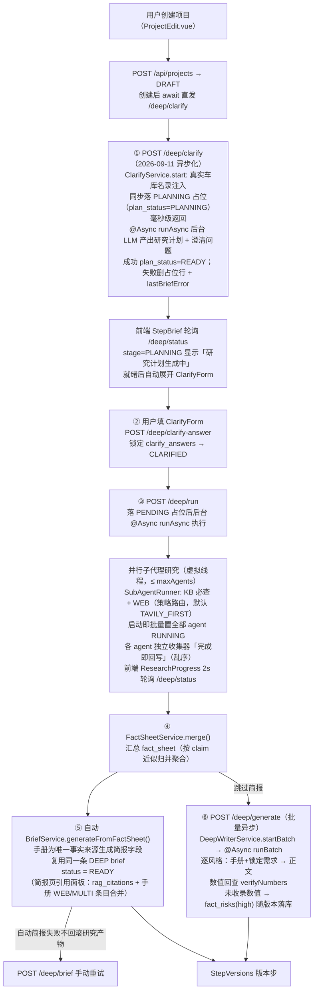

# 简报生成（深度模式 · 唯一生成链路）

> 回链：[系统说明总览](../README.md)

职责：把「主题」变成「简报」。**这是当前唯一的简报生成链路**——快速模式（FAST）已于 2026-09-09 下线（接口保留但恒 `R.fail(410)`），所有创作项目都走深度模式六阶段。

- 深度模式仅作用于 brief 层（`gen_mode=DEEP`），**项目状态机（[overview.md §4](overview.md)）不变**；`PLANNING/CLARIFYING/RESEARCHING` 为 `/deep/status` 展示态，非项目状态。
- 断点续跑：每阶段产物落库（`research_plan`→`clarify_questions`→`clarify_answers`→`research_notes`→`fact_sheet`），可从任意阶段恢复。

---

## 1. 六阶段流程

> ①理解（研究计划）→ ②一次性澄清表单 → ③并行子代理研究（KB+WEB）→ ④事实手册 → ⑤自动生成简报 → ⑥（跳过简报时）深度写作 + 数值回查。

```mermaid
graph TD
    U["用户创建项目（ProjectEdit.vue）"] --> C0["POST /api/projects → DRAFT<br/>创建后 await 直发 /deep/clarify"]
    C0 --> D1["① POST /deep/clarify（2026-09-11 异步化）<br/>ClarifyService.start: 真实车库名录注入<br/>同步落 PLANNING 占位（plan_status=PLANNING）毫秒级返回<br/>@Async runAsync 后台 LLM 产出研究计划 + 澄清问题<br/>成功 plan_status=READY；失败删占位行 + lastBriefError"]
    D1 --> D1b["前端 StepBrief 轮询 /deep/status<br/>stage=PLANNING 显示「研究计划生成中」<br/>就绪后自动展开 ClarifyForm"]
    D1b --> D2["② 用户填 ClarifyForm<br/>POST /deep/clarify-answer<br/>锁定 clarify_answers → CLARIFIED"]
    D2 --> D3["③ POST /deep/run<br/>落 PENDING 占位后后台 @Async runAsync 执行"]
    D3 --> D4["并行子代理研究（虚拟线程，≤ maxAgents）<br/>SubAgentRunner: KB 必查 + WEB（策略路由，默认 TAVILY_FIRST）<br/>启动即批量置全部 agent RUNNING<br/>各 agent 独立收集器「完成即回写」（乱序）<br/>前端 ResearchProgress 2s 轮询 /deep/status"]
    D4 --> D5["④ FactSheetService.merge()<br/>汇总 fact_sheet（按 claim 近似归并聚合）"]
    D5 --> D6["⑤ 自动 BriefService.generateFromFactSheet()<br/>手册为唯一事实来源生成简报字段<br/>复用同一条 DEEP brief<br/>status = READY<br/>（简报页引用面板：rag_citations + 手册 WEB/MULTI 条目合并）"]
    D6 -->|"自动简报失败不回滚研究产物"| D7["POST /deep/brief 手动重试"]
    D5 -->|"跳过简报"| D8["⑥ POST /deep/generate（批量异步）<br/>DeepWriterService.startBatch → @Async runBatch<br/>逐风格：手册+锁定需求 → 正文<br/>数值回查 verifyNumbers<br/>未收录数值 → fact_risks(high) 随版本落库"]
    D6 --> V["StepVersions 版本步"]
    D8 --> V
```

---

## 2. 数据模型（§13，Flyway `db/migration/V1__baseline.sql` 建表/补列，已同步 entity）

- `sparkora_article_brief` 增列：
  - `gen_mode TEXT DEFAULT 'FAST'`（2026-09-09 模式收敛：新 brief 恒为 DEEP，FAST 默认值仅存量语义；存量行不迁移）
  - `clarify_questions TEXT`、`clarify_answers TEXT`、`research_plan TEXT`、`research_notes TEXT`、`fact_sheet TEXT`
  - `rag_citations TEXT`（知识引用明细，见 [retrieval.md](retrieval.md)）
  - `plan_status VARCHAR(20)`（2026-09-11 clarify 异步化：DEEP 行 `PLANNING`=研究计划生成中 / `READY`=已就绪；FAST/IMITATION/存量行 null）
  - 部分唯一索引 `uq_brief_planning ON sparkora_article_brief(project_id) WHERE plan_status='PLANNING'`——同一项目同时至多一条 PLANNING，双击/双开触发的数据库级并发兜底（撞索引转 409）。
- `sparkora_article_version` 增列：`fact_risks TEXT`（数值回查结果，JSON 数组 `[{claim,riskLevel,suggestion}]`）、`rag_citations TEXT`（知识引用明细，见 [version-generation.md](version-generation.md)）。
- `sparkora_article_brief.style_recommendations TEXT`（仅 `gen_mode=IMITATION` 使用，见 [imitation.md](imitation.md)）。

---

## 3. 接口契约

全部 `R<T>` 包装；方法级 `@PreAuthorize`；前缀 `/api/projects/{projectId}/deep`。

| 方法 | 路径 | 权限 | 请求 | 响应 |
|---|---|---|---|---|
| POST | `/deep/clarify` | ADMIN/EDITOR | `{topic(必填), extraInfo?}` | **2026-09-11 异步化**：`{briefId, stage:"PLANNING"}`，毫秒级返回（不再携带计划内容）；同步落 PLANNING 占位 brief(`gen_mode=DEEP`)，后台 `@Async` 生成研究计划与澄清问题，成功回写 plan/questions + `plan_status=READY`；失败删除占位行 + 写 `project.last_brief_error`。并发/陈旧冲突 → `R.fail(409,...)` |
| POST | `/deep/clarify-answer` | ADMIN/EDITOR | `{briefId, answers:{问题:答案}}` | `{briefId, locked}`（锁定 JSON 落库） |
| POST | `/deep/run` | ADMIN/EDITOR | `{briefId}` | `{briefId, agents, started:true, strategy, webProviderOrder}`（同步校验 + 落 PENDING 占位后立即返回；后台 `@Async` 执行，前端轮询 status。前置：brief 存在且属于路径 projectId、`gen_mode=DEEP`、`clarify_answers` 已锁定，否则 400；`plan_status=PLANNING`（计划生成中）或研究计划无关键问题 → 409；同一 brief 已在研究中 → 409「该 brief 正在研究中，请勿重复触发」） |
| POST | `/deep/generate` | ADMIN/EDITOR | `{briefId, styleIds:[...]}`（09-27-gen-async 批量：一次提交多风格，后端保序回查风格表取 `toneGuidance`/`name`；查无 → 400「风格不存在或已删除」；兼容单 `styleId`（数组化）与旧 `stylePrompt`/`styleName`，deprecated；`styleIds` 缺省时按「无风格」生成一版） | **09-27-gen-async 异步化**：`{status:"GENERATING_VERSIONS", styleCount:N}`，毫秒级返回；同步 claim `GENERATING_VERSIONS`（源态 READY/DRAFT/VERSIONS_READY 或陈旧）后后台 `@Async` 逐风格生成，成功 `advanceVersionsReady`（部分失败写 `last_version_error`）、全部失败 `failVersionsToReady`；版本仍补齐 `title`/`version_label`/`style_tag`/`word_count` 与 `fact_risks`，首版设 current（追加不覆盖）。重复触发 409 |
| POST | `/deep/brief` | ADMIN/EDITOR | `{briefId}` | `ArticleBriefEntity`（基于事实手册生成简报，落同一条 DEEP brief 行并推状态机到 READY；研究完成后自动触发一次，此处为手动重试入口；409=状态冲突。**R6 09-26**：`generateFromFactSheet` 首次 `chatJson(...,8192)`，截断/空内容/非法 JSON 时翻倍 `16384` 重试一次，仅两次均失败才回 DRAFT + `lastBriefError`） |
| GET | `/deep/status` | 三角色 | `?briefId`（缺省取最新 DEEP brief） | `{briefId, genMode, stage, planStatus, researchPlan?, questions?, answers?, agents?, factSheet?, toolHealth:{KB,SEARXNG,TAVILY}, webStrategy, webProviderOrder}` |

- stage 判定（brief 层展示态）：`PLANNING`（`plan_status=PLANNING`，clarify 占位生成中，2026-09-11 新增，优先于其余判定）> `RESEARCH_DONE`（`fact_sheet` 非空）> `RESEARCHING`（`research_notes` 非空）> `CLARIFIED`（`answers` 非空）> `CLARIFYING`（`questions` 非空）> `NONE`。
- toolHealth（2026-09-15 契约升级，值由布尔改状态码 `OK|DISABLED|UNCONFIGURED|FAILED`）：
  - `KB` = `kb_enabled ? OK : DISABLED`（反映设置页运行时门控，不再恒 true）。见 [settings.md](settings.md)。
  - `SEARXNG`/`TAVILY` 先判 `SEARCH_WEB_ENABLED && webSearchEnabled`（false → `DISABLED`），再按 `configured()`（密钥/地址就绪）→ `UNCONFIGURED`、`lastCallOk()`（最近一次调用健康态，初值乐观）→ `FAILED`/`OK`。
  - 优先级 `DISABLED > UNCONFIGURED > FAILED > OK`。前端未拿到该字段时渲染 `--`（未知态，不谎报可用）。
  - `webStrategy`（09-25 增量）：有效策略标签 `TAVILY_FIRST`/`SEARXNG_FIRST`（运行时全局设置优先 → 部署级默认）；`webProviderOrder` 为规范化 provider 串。**配置就绪不等于已验证可用**——是否真的命中以 agents[].search 的实际调用结果为准。
- 权限冒烟：viewer 访问写接口 403（`hasAnyRole('ADMIN','EDITOR')`）。

> 轮询注意：前端轮询必须携带**本次启动返回的 briefId** 精确定位（占位行失败被删后按 projectId 取最新会回退到更早旧行，误判状态）。

---

## 4. 工具层（SearchTool 抽象，`com.sparkora.deep.tool`）

| 工具 | 实现 | 来源 | 降级语义 |
|---|---|---|---|
| KB | `KnowledgeSearchTool` | 委托 `CarRagService.retrieveForGeneration` 统一检索（[knowledge/kb.md](knowledge/kb.md)，S8） | 异常 warn，不抛出 |
| SEARXNG | `SearxngSearchTool` | GET `{SEARXNG_BASE_URL}/search?q=&format=json&language=zh-CN` | 超时/空结果静默空列表 + `lastCallOk()=false`（仅供健康展示）；`available()` 仅判地址就绪，失败不闩锁 |
| TAVILY | `TavilySearchTool` | POST `api.tavily.com/search` `{api_key,query,max_results,search_depth}`；09-27 增 `POST /extract` 正文补抓（见「背景题正文补抓」） | 密钥未配置 → `available()/configured()=false`；调用失败仅置 `lastCallOk()=false`，下次研究自动重试；`extract` 失败不污染 `lastCallOk()` |

- **WEB 策略路由（09-25，取代旧硬编码 SEARXNG→Tavily）**：`WebSearchRouter`（`com.sparkora.deep.search`）按快照策略顺序逐个尝试 provider，首个产出**有效命中**即采信并停止；provider 未配置跳过（`UNCONFIGURED`）、异常/超时/空结果/结果全部无有效 URL 记降级原因后尝试后备源。每次研究启动时解析一次 `WebSearchSnapshot`（策略 + 双开关），同批次全部子代理共用，启动后设置变更不影响。MVP 仅两策略：`TAVILY_FIRST`（默认，`TAVILY,SEARXNG`）/ `SEARXNG_FIRST`（`SEARXNG,TAVILY`）；不支持 BOTH 双源聚合。**默认反转**显式推翻 2026-09-15「SEARXNG 优先」决策（Tavily 已配置却从未被调用、SearxNG 上游曾全部不可用）。
- **WEB 结果治理（R8/R9）**：`WebResultNormalizer` 在子代理/LLM 之前完成协议校验（仅 http/https 绝对 URL）、URL 规范化（去 fragment、小写 scheme/host）、按规范化 URL 去重、截断，并分配稳定 `sourceId`（`W1,W2…` 按本次输入顺序）。`SearchHit` 增量带 `sourceId`/`provider`（旧 7 参构造器保留兼容）。
- **事实后验校验（R9）**：`SubAgentRunner.validateFacts` 只接受引用本次输入 `sourceId` 且 URL/provider 匹配的 WEB 事实；未知 sourceId / URL 或 provider 不匹配 → 从 facts 剔除并转为 gap（不整条 agent 失败）。模型生成的 URL 不作为可信证据——**凡携带 `url` 或 `sourceId` 的事实一律按 WEB 声明校验**（即使模型漏标/误标 `type`），通过后 `type` 归一为 `WEB`（防 FactSheet 默认按 KB 0.9 采信）；仅缺 `type` 且无 `url`/`sourceId` 的 KB 事实沿用既有行为。
- **WEB query 构造（R7）**：项目主题 + 研究问题 + **已锁定**澄清答案（`clarify_answers` 中非空 `a`，去重）；未锁定答案绝不进入 query。**否定答案过滤（R5，09-27-brief-writing-linkage-fix）**：语义为「放弃/无偏好」的否定值（精确匹配「不对比/不比较/无所谓/都可以/都行/不限/无偏好/随便/暂无/不需要/无/没有/不涉及/跳过」+ `不对比`/`不需要` 前缀）不注入 query——「不对比」描述的是用户的不选择，拼入只会制造搜索噪声；正常答案不受影响（仅精确匹配 + 两前缀，不做模糊包含以免误伤「无框车门」这类正常答案）。
- **背景题正文补抓（R1/R3，09-27-tavily-extract-kind-hypotheses，机制 B）**：`SearchTool` 增 `default List<SearchHit> extract(urls, query)`（默认空，`TavilySearchTool` 覆写为 `POST /extract`：`{api_key, urls, query, chunks_per_source:3, extract_depth:"basic"}`，取 `raw_content` markdown，**工具层截断**到 `DEEP_WEB_CONTENT_MAX_CHARS`（默认 2000，唯一上限））。
  - 触发条件：**仅背景型问题**（`ClarifyService.isBackgroundQuestion`）且 WEB 命中后，对 **top 1–2 条 URL** 调 `WebSearchRouter.extract`（保持工具抽象，不在子代理硬编码 Tavily 依赖）；抽取结果按**规范化 URL** 回填对应命中。
  - 降级：抽取失败/空（`failed_results`/空 `results`）/Tavily 不可用/异常 → 命中保持 `content=null`，**降级回摘要**，绝不抛出、不阻断研究；`extract` 不修改 `lastCallOk()`（不污染搜索健康态）。
  - 注入分档：背景题 ctx 对带 `content` 的命中追加 `正文片段:` 行；**参数题只用 `snippet`、不注入正文**（且从不触发 `extract`）。
  - 载体字段：`SearchHit` 增 nullable `content`（与 `snippet` 摘要语义严格区分——引用/预览仍用 `snippet`）；`WebResultNormalizer.WebHit` 增 `content` 并 `toSearchHit()` 透传；两者均**保留旧构造器**（9/7 参与 5 参）向后兼容。`SubAgentRunner.rawFallback` 降级产物在 `content` 非空时增 `"content":esc(...)`（JSON 转义完整，空则不出现该字段）。
  - 配置：`sparkora.deep.web-content-max-chars` ← `.env DEEP_WEB_CONTENT_MAX_CHARS`（默认 2000）。

- 每子代理 `webQuota=max(1, 8/n)` = **单 provider 返回条数上限**（不是全程调用预算）；`SEARCH_WEB_ENABLED=false` 或运行时 `webSearchEnabled=false` 时为 0（纯 KB）。
- **KB 锚点感知检索（R1，2026-09-06）**：`KnowledgeSearchTool.search(query, maxResults, anchors)` 委托 `retrieveForGeneration`（锚点加权 + 参数级子查询 + 核心块/权益块分层配额）；锚点由 `DeepResearchService.resolveAnchors` 解析（项目关联车型为准 → `CarModelMatcherService` 按主题识别兜底，失败不阻断）；子代理 KB 检索 query 用「主题 + 问题」复合语料（纯问题如「价格对比」缺车型上下文相似度必散）。非 OK 状态返回空列表归 gaps（行为同旧）。
- **WEB gap 驱动（R1 同批）**：KB 已命中车型域权威块（命中含 MODEL_INFO/价格区间文本）时跳过 WEB 补查——WEB 只补 KB 缺口，不与 KB 平行全问题重搜、不得覆盖 KB 结论。**仅对参数型问题生效（R2，09-27-brief-writing-linkage-fix）**：命中权威块且问题非背景型（`ClarifyService.isBackgroundQuestion` 判定为背景/来龙去脉型，命中 `BACKGROUND_TERMS ∪ BACKGROUND_SIGNALS` 任一）才跳过；**背景题永不因 KB 命中 MODEL_INFO 跳过 WEB**——KB 是车型库，不含行业战略类背景内容，而车型锚定主题下背景题的复合 query（主题+问题+锚点加权）几乎必然命中该车型 MODEL_INFO，旧判定会机制性阻断背景题的外部素材。
- **同 claim 冲突裁决（R2，2026-09-06）**：`FactSheetService.merge` 聚合时同 claim 同时含 KB 与 WEB 来源 → **KB 胜出**（不比较相似度/置信度，量纲不同不可比；按来源身份定优先级：本系统知识库（比亚迪同步清洗）> 外部 WEB）。WEB 条目降级为该条目 `alternatives`（URL 列表）去重后留证据，并写 warnings「以知识库为准；外部来源(N 条)有异说,未采用」。纯 KB / 纯 WEB 条目维持原置信规则（KB 0.9 / 多源交叉 0.85 / 单一 WEB 0.4 + 待核实）。
- **近似 claim 归并（09-25-fact-claim-merge，取代纯字符串精确匹配）**：`FactSheetService.merge` 用 `ClaimSimilarity` 贪心聚类——按事实出现顺序，与簇首条（代表 fact）满足 `sameClaim` 即归入，否则新开簇；代表 fact 决定条目 `key/claim/value`（「首条为准」，与旧精确匹配一致）。
  - **数值签名硬前提**：`sameClaim` 先按 claim+value 抽出的数值集合（`numberValues`，去千分位、万×1e4、亿×1e8，`BigDecimal` 归一，使 `200000`≡`20万`）比较，**集合必须完全相等**；数值冲突（第2000座 vs 第1500座）或一侧有数值另一侧没有 → 直接不合并（绝不越过）。
  - **旧精确匹配短路先于相似度、但晚于原文判等**：`claim` **原文 trim 后完全相同** → 直接同一事实（严格保留旧「按 claim 精确匹配分组」行为，含 KB+WEB 同 claim 冲突裁决路径——即便 value 有异也先聚成一条再走 KB 胜出）。注意**不能**用「规范化后相同」短路：`normalize` 丢弃小数点/千分位，`1.5万` 与 `15万`、`2.9米` 与 `29米` 规范化成同一串，先短路会把数值冲突误并；故非原样相同的 claim 一律走数值签名硬前提。
  - **相似度阈值**（仅在硬前提通过后生效）：3-gram 重合率(Jaccard 风格)与最长公共片段占比取平均；有数值 `≥0.45`（数值已锁定同一事实），无数值定性 claim `≥0.70`（仅措辞级差异，误合并防护优先于召回）。常量 `ClaimSimilarity.TH_NUMERIC/TH_TEXT`。
  - 纯本地、确定、可单测、不调 LLM、无新增依赖；不改变搜索路由/provider 策略与 `webCount`/`search` 观测口径。
- `SearchHit.web(type=工具名→展示源)`：type 统一为 `WEB`（计数依据），工具名记 `modelName` 字段。
- 密钥链：`DEEP_TAVILY_API_KEY`(System property/env) → `TAVILY_API_KEY` → `sparkora.deep.tavily-api-key`（`DeepProperties` 绑定前缀 `sparkora.deep`，2026-09-15 修正；dotenv 注入 System property，嵌套占位符 `${A:${B:}}` Spring 不支持，故 yml 只挂 `TAVILY_API_KEY`）。

---

## 5. 研究笔记 / 事实手册结构

- `research_notes`：`[{agentId, question, status(DONE/FALLBACK/FAILED), factsJson, webCount, search}]`；`factsJson`=`{facts:[{claim,value,snippet?,source:{type:"KB|WEB",sourceId,provider,url,modelName,docId},confidence}],gaps:[...]}`。`search`（09-25 增量，可空）为 `{strategy, provider, query, resultCount, latencyMs, fallbackReason, attempts:[{provider,resultCount,latencyMs,fallbackReason,ok}]}`——**不含任何密钥**；`webCount` 语义改为实际接受的 WEB 结果数。**口径一致性**：`webCount`/`search.resultCount` 描述搜索结果，LLM 汇总失败走 `rawFallback` 原始条目降级时**不归零**，且此时 `search.fallbackReason=LLM_FALLBACK`（provider 层 `attempts` 原因保持原样，两类失败不混淆）。
- **降级保真 snippet（R1，09-26）**：`SubAgentRunner.rawFallback` 每条降级 fact 在 `claim`(title) 之外增 `snippet`（≤200 字，转义完整）——关键背景（如「年内 2 万座、含这 2000 座」）常写在检索命中正文而非标题，旧实现只取 title 会让降级路径丢失素材。snippet 只为「素材可用」保真，不替代 LLM 抽取；降级仍标 `FALLBACK` + gap。`FactSheetService` 透传簇内首个非空 snippet 到 entry（增量可选字段，无则不出现，旧契约零回归）；写作/简报 prompt 可见该证据。
- **逐 agent 实时回写语义（2026-09-26 修复）**：`run()` 落 `PENDING` 占位后，`doRunAsync` 在 **submit 任何子代理之前**一次性把全部 N 个 agent 覆写为 `RUNNING`（AC-01）——首轮 2s 轮询即可见多 agent 并行 RUNNING，不再有「1 个 RUNNING + 其余 PENDING」假象。随后每个 agent 由一个**独立收集器**任务（同一虚拟线程池）驱动：其自身 `future.get(researchTimeoutMs)` 完成/超时/异常后**立即回写**该 agent 的 `status/factsJson/webCount/search`（AC-02）——谁先完成谁先落库，天然乱序，不再被慢的 `future[0]` 串行阻塞，消除 `PENDING→DONE` 集中瞬变。超时/异常仍 `cancel(true)` + `FAILED` + gap「子代理超时或失败」，失败隔离不回归（AC-04/AC-05）。全部收集器 join 后才执行 `FactSheetService.merge` 与自动简报，顺序不变（AC-06）。`/deep/status` 输出契约与 `status` 值域 `PENDING/RUNNING/DONE/FALLBACK/FAILED` 不变。
  - **LLM 汇总截断/失败重试（R4，09-26）**：`SubAgentRunner.chat` 首次 `chatJson(...,2048)`；任何失败（`finish_reason=length` 截断 / 空内容 / 非法 JSON）均**提额 `4096` 重试一次**（附纠错说明），仅重试仍失败才抛出 → `research` catch → `FALLBACK`。净调用上限仍 2 次/agent，仅重试额度提高并覆盖截断场景（旧实现仅在非法 JSON 时重试且额度仍 2048，截断直接冒泡降级）。
  - **并发写安全**：收集器并发调用 `updateAgent` 为「读整段 JSON → 改指定 agentId → 写回」，无锁会丢失更新。以 per-brief 锁（`ConcurrentHashMap<Long,Object>` + `synchronized`）串行化同一 brief 的写入，不同 brief 互不阻塞；锁在批次结束（`runAsync` finally）清理，避免 map 无界增长。启动批量置 RUNNING 与收集器回写共用同一把锁。
- `fact_sheet`（`FactSheetService.merge`，按 claim **近似**去重聚合）：`{entries:[{key,claim,value,kind?,snippet?,sources:{type,url,modelName,docId},crossCount,confidence,sourcesList:[{type,sourceId,provider,url,modelName,docId}],sourceCount}],gaps:[...],warnings:[...]}`。`sources.type` 取值 `KB|WEB|MULTI`（`MULTI`＝多源交叉，代表来源基础上标注）。`sourcesList`/`sourceCount` 为 09-25 **增量字段**（保留全部来源证据含 provider，供引用面板/人工核对；前端旧逻辑不读也不报错）。`snippet` 为 09-26 **增量字段**（R1：簇内首个非空降级 snippet，无则字段不出现）。`crossCount`/`sourceCount` 为**去重后来源数**（同 url+modelName 只计一次，不再等于原始 fact 条数）。
- **条目 `kind` 分类（R4，09-27-tavily-extract-kind-hypotheses）**：`entry.kind` 取值 `param|background`，继承**产出该 fact 的研究问题类型**（`ClarifyService.isBackgroundQuestion(question)` → `background`，其余/无问题关联/历史数据 → `param`）；`merge` 展开 facts 时并行记录所属 note 的 question，聚类后取**簇首条（代表 fact）**的 kind。字段**显式写**（增量字段，旧前端不读不报错，对齐 `sourcesList` 范式）；缺 kind 消费方兜底 `param`。

- 置信度规则：多源交叉（去重来源 ≥2）0.85 交叉标注 / KB 0.9 / 单一 WEB 0.4 + warnings「仅单一 WEB 源,待核实」/ 同簇 KB+WEB 冲突时 KB 胜出（0.9，WEB 进 `alternatives`）。
- 已知限制：WEB 命中默认仍为摘要级（`snippet`）；**仅背景题**对 top 1–2 URL 用 Tavily `/extract` 补正文片段（工具层截断，默认 2000 字），参数题不补抓、SearxNG 命中依赖 Tavily key 才能补正文（key 不可用即退回摘要）。低置信条目以 warnings 提示人工核实。

---

## 6. 深度写作与数值回查

- `DeepWriterService.write`：`fact_sheet` 条目进 prompt（条目带 `snippet` 时追加 `| 证据:{snippet}`，≤200） + **简报四字段显式注入**（R1，09-27-brief-writing-linkage-fix：`titleCandidates`/`coreViewpoints`/`outline`/`factRisks` 经 `appendBriefSection` 追加——数组逐项 `- ` 列出、outline 用 `toString`、空/null/`[]`/`{}` 跳过、解析失败按原文追加且全程 try/catch 仅 warn；历史 brief 无字段时 prompt 与旧行为逐字等价）+ **按 `kind` 分组呈现（R5，09-27-tavily-extract-kind-hypotheses）**：手册条目带 `kind` 时分为「【参数事实】(可逐字引用数值)」与「【背景素材】(仅用于叙事,不得据此新增数值)」两段（背景素材出现的数字也不得写进正文）；**全无 `kind`（历史 fact_sheet）时退化为原平铺行为**（prompt 逐字与旧实现等价）；缺 kind 的条目兜底进参数组。 + 铁律「数值必须逐字出自手册」→ `AiClient.chat`（非 JSON 方法）→ 落 version（复用版本链路，见 [version-generation.md](version-generation.md)）。
- **正文截断提额重试（R4，09-27-brief-writing-linkage-fix）**：正文是全链路最长输出，此前是唯一无重试的 AI 调用。`write` 首次 `chat(system,user,4096)`；任何失败（`finish_reason=length` 截断 / 异常）提额 `8192` **重试一次**（附纠错说明），仅两次均失败才抛 `AiException` → `runBatch` catch 计入该版本失败（部分/整体失败语义不变）。`AiClient.ChatResult` 增第 4 分量 `finishReason`（保留 3 参构造器兼容既有调用方/测试），`parseChat` 始终透出 `finish_reason`——非 JSON 调用截断时不抛异常，调用方须据此判定重试。重试只包裹 AI 调用，版本 `insert` 仍只执行一次（无重复落库）。
- 数值回查（正则，0 次 LLM）：抽取正文数值（万/千分位/百分比/带单位 `km|kWh|kW|mm|L/100km|s`）与手册比对，手册外数值 → `fact_risks` `[{claim,riskLevel:"high",suggestion:"发布前必须人工核实或删除"}]` 落版本字段。
- **注入目标字数 + 自适应分节（R1/R2/R3，09-27-deep-writing-adaptive-sections；09-27-shared-layout-rules）**：`write` 取一次项目快照（复用给 `extractH1`，不新增查询放大），user prompt 首行注入 `目标字数：N`（全角冒号,口径对齐 `VersionService`：项目 `wordCountTarget` 为 null/≤0 → `1500`）；system prompt 的排版铁律「节数行」由共享类 `com.sparkora.service.LayoutRules.sectionSpec(Integer)` 按目标字数分档动态生成（其余铁律 1/2/3、`hasKind` 时铁律 4、结尾「加粗/单段 ≤5 行」逐字保留）。**分节档位由共享 `LayoutRules` 统一（深度写作与 `VersionService` 两链路同档，各自文案格式不变——深度保持单行分号串、`VersionService` 保持三段 bullet 列表）**：

  | 目标字数 | 小标题数 | 每节段数 |
  |---|---|---|
  | ≤ 800 | 2~3 | 2~3 |
  | 801~1800 | 3~5 | 2~3 |
  | 1801~3000 | 5~8 | 2~3 |
  | > 3000 | 8~12 | 2~4 |

  边界语义：`null`/`≤0`→1500 档（3~5）；`800`→2~3；`801`→3~5；`1800`→3~5；`1801`→5~8；`3000`→5~8；`3001`→8~12；`10000`→8~12；不抛异常。深度写作与 `VersionService`（多版本/仿写）两链路共用同一分档（`VersionService.generateOne` 的 `layoutRules` 首行按 `p.getWordCountTarget()` 自适应，其余两条 bullet 逐字保留）。
- 2026-09-04 实测：version 1917 字符，捕获手册外「25万」high 1 条。

---

## 7. 前端（`views/project/deep/` 四组件 + StepBrief 深度分支）

- 反问题型：`input` / `single`（radio）/ `multi`（checkbox，车型锚点多选；提交时以「、」拼接、回显时按「、」还原数组）。`ClarifyForm` 支持全部三型（2026-09-05 增补 multi）。
- **研究计划两类维度（R2，09-26）**：`keyQuestions` 数量 3~7 随主题复杂度伸缩；维度须兼顾「事实/参数型」（价格/尺寸/参数/对比）与「背景/来龙去脉型」（行业背景/企业战略/长期目标/政策脉络/意义）。LLM 判断为主（窄参数主题可无背景题；事件/发布/宣布/战略/政策/规划/里程碑类主题必须至少一条背景题），`ClarifyService.ensureBackgroundQuestion` 确定性兜底——主题/补充信息命中信号词（发布/宣布/建成/落成/完成/启用/战略/计划/规划/政策/里程碑/首个/突破/布局/进军）且现有问题无背景型检测词（背景/战略/规划/目标/意义/来龙去脉/发展历程/布局/为什么/如何演变）时，追加一条背景题并同步补 `toolHints`（保证问题:提示 1:1，避免落到 KB-only 默认）；幂等、异常静默降级。
- **反问必须基于车库名录（2026-09-05 修复）**：`ClarifyService` 注入 `CarModelService.list()` 名录（名称+价格区间）进 prompt；规则：车型/竞品/对比类问题的 options 只能从名录选、不得编造；主题指向某款/某系列车型时必须有一道 multi 锚点车型题（options 覆盖名录中含该系列词的全部车型）。车库获取失败降级为不注入并提示不编造车型。
- **竞品对比题强制多选（R1，2026-09-05）**：prompt 明确「对比/竞品/比较/竞对类问题 `type=multi`（选项 2~4 个竞品 + 「不对比」兜底）」；后端 `ClarifyService.normalizeQuestions` 确定性归一化兜底（不依赖 LLM 遵守）：问题文本含竞品信号词（对比/竞品/比较/竞对/竞争）的选项题强制 `type=multi` 并补「不对比」选项（缺省时）；无选项的竞品题归 `input`（自由填写）；解析失败原样保留不阻断。
- **「其他(自行填写)」（R2，2026-09-05）**：`ClarifyForm.vue` 对 single/multi 题渲染「其他(自行填写)」入口——single 选中后切文本框（提交取文本框内容），multi 勾选后文本并入答案（「、」拼接）；锁定回显时不在 options 中的答案自动归「其他」并回填。
- 组件：`DeepPlanCard`（研究计划）/`ClarifyForm`（生成↔锁定回显两态）/`ResearchProgress`（2s 轮询 status + 工具健康行 toolHealth 徽标）/`FactSheetSummary`（手册摘要 + 来源徽标 KB 蓝/WEB 紫 + 置信度条 + gaps/warnings）/`CitationList`（引用明细）。
- **降级原因可见（R3，09-26）**：`ResearchProgress` 的降级行数据源为 `search.fallbackReason`（非空）∪ `attempts[].ok===false && fallbackReason`；`reasonText` 含 `LLM_FALLBACK: '汇总降级(已用原始条目)'`。修复旧实现只读 attempts（LLM 降级时 attempts 全 ok=true，进度页对 3/4 降级不显示任何原因）。**避免错标**：`search.fallbackReason` 的 provider 字段是**成功采信**的 provider，故仅当 `attempts` 中无同一原因的失败项时才补该行（`LLM_FALLBACK` 时 attempts 全 ok 必补；provider 层原因由 attempts 行展示，不重复不错挂）。
- **WEB 来源展示 provider（R10，09-25）**：`CitationList.vue` 对 WEB 条目渲染「provider · 域名」（如 `Tavily · stnn.cc`），`FactSheetSummary.vue` 的 WEB 徽标渲染 `WEB·{provider}·{域名}`；provider 取自 `fact_sheet.entries[].sources.provider`（09-25 增量字段）。**历史 `fact_sheet` 可能缺 `provider` → 必须容错回退**为旧文案（仅域名）；纯展示层，不改请求/响应结构。
- **研究完成 → 自动生成简报（2026-09-05 修复）**：`DeepResearchService.runAsync` 落 `fact_sheet` 后自动调 `BriefService.generateFromFactSheet`（LLM 一次，以事实手册为唯一事实来源 + 锁定需求 → 简报五字段落同一条 DEEP brief 行，`currentBriefId` 指向该行，状态机 GENERATING_BRIEF→READY）；失败不回滚研究产物（回 DRAFT + `lastBriefError`，深度面板可手动重试 `/deep/brief`，也可「跳过简报直接生成正文」）。修复「确定研究计划/研究完成后没有简报页面」的结构性缺陷。
- **深度简报截断容错（R6，09-26）**：R5 放大事实手册（project 52 / brief 66 实测 17 条 / 10294 字）后旧 `chatJson(...,2048)` 系统性不足（`finish_reason=length` 截断 → 项目回 DRAFT）。现 `generateFromFactSheet` 首次 `chatJson(...,8192)`；**任何失败**（截断 / 空内容 / 非法 JSON / readValue 失败）翻倍提额 `16384` **重试一次**（附纠错说明），仅重试仍失败才落 DRAFT + `lastBriefError`。重试**独立实现**于 `BriefService`（不抽公共 helper、不与已删除的 FAST 路径共用），范式对齐 `SubAgentRunner.chat`（R4）。同时删除已死的 FAST 简报路径（`generate(Long)` / `buildSystemPrompt` / `buildUserPrompt(p,RagResult)` 及仅其使用的 `ragService`/`carService` 依赖）；`generateFromFactSheet`/`currentBrief` 行为不变。
- **简报注入研究假设（R6，09-27-tavily-extract-kind-hypotheses）**：`buildDeepBriefUserPrompt` 追加 `research_plan.hypotheses`（解析为数组则逐项 `- ` 列出），使 `coreViewpoints` 显式回应「假设被证实/推翻」；`buildDeepBriefSystemPrompt` 增一条要求——每条假设都要能在观点中找到明确回应（证实→据实展开；推翻→指出与手册事实不符），未提供假设时不得编造。`research_plan` 缺失/无 `hypotheses`/空数组/畸形 JSON → **跳过该块（兼容退化，不报错）**，prompt 与旧行为等价（仅 system 多一条要求）；全程 try/catch 仅 warn。
- `StepBrief.vue`（2026-09-11 单一状态机收敛，09-11-brief-gen-flow-refactor）：**无 FAST/DEEP 模式切换**——唯一生成路径为深度流程，无简报区间由唯一 `deepStage` 状态机驱动（值域 `NONE|PLANNING|CLARIFYING|CLARIFIED|RESEARCHING|RESEARCH_DONE`），同一状态恒渲染同一 UI，与进入路径（创建直发/重新进入/仅存草稿）无关；**删除 `deepMode` 路径意图布尔与 6s 有界重探测**。project 就位后 `syncDeepStatus()` 单次拉 `/deep/status` 断点恢复（PLANNING 则续起 2.5s 自轮询），不再依赖 `?gen=deep`。「重新研究生成」直接 `startDeep()` 进 PLANNING（`restarting` 标志跳过旧简报正文分支，新简报落库后恢复）。无简报区间只保留**一个**主操作「开始深度研究」，删除「开始深度研究→生成研究计划」两步链与裸生成按钮。CLARIFYING/RESEARCHING 仅 brief 展示态，项目状态机不变（`constants/project.js` 注释）。RESEARCH_DONE 态下简报正常展示（自动简报完成即 READY）；失败显示「重新生成简报」+「跳过简报,直接生成正文」。`ragStatus` 展示含 `DISABLED`（知识库已停用·全局设置，灰，见 [retrieval.md](retrieval.md)）。
- 移动端：单列纵排、抽屉全屏、触控 ≥44px。

---

## 8. 配置（.env.example 已同步）

| 变量 | 默认 | 说明 |
|---|---|---|
| `SEARCH_WEB_ENABLED` | `true` | WEB 搜索部署级总开关（与运行时 `webSearchEnabled` 相与） |
| `DEEP_WEB_PROVIDER_ORDER` | `TAVILY,SEARXNG` | 部署级默认 provider 顺序（运行时 ADMIN 设置优先）：`TAVILY,SEARXNG`=TAVILY_FIRST / `SEARXNG,TAVILY`=SEARXNG_FIRST |
| `TAVILY_API_KEY` / `DEEP_TAVILY_API_KEY` | 空 | Tavily 密钥（`.env`；`DEEP_` 前缀可覆盖） |
| `SEARXNG_BASE_URL` | `http://localhost:5676` | SEARXNG 实例（本机/内网部署，2026-09-04 迁移至 192.168.3.108:5676） |
| `CRAWL4AI_BASE_URL` | 空 | 预留：Crawl4AI 正文抓取工具未接入（正文补抓改由 Tavily `/extract` 承担，见 §4「背景题正文补抓」） |
| `DEEP_WEB_CONTENT_MAX_CHARS` | `2000` | 背景题 WEB 正文补抓单条上限（字符）：Tavily `/extract` 取正文后**工具层截断的唯一上限**（09-27 R1；参数题不补抓，抽取失败/空降级回摘要） |
| `DEEP_RESEARCH_TIMEOUT_MS` | `120000` | 单子代理超时（futures.get 兜底，超时→FAILED+gap） |
| `DEEP_MAX_AGENTS` | `6` | 子代理数上限（R5 09-26 由 4 放宽为 6；虚拟线程 per-task executor；总检索预算约 8 → `webQuota=max(1,8/n)`）。**窗口选择（R3，09-27-brief-writing-linkage-fix）**：计划问题数超过预算时不再「截前 N 条」——`DeepResearchService.selectResearchWindow` 在预算内**优先保背景/来龙去脉型问题**（`ClarifyService.isBackgroundQuestion`），其余按原序补足，最终索引升序归位（`run` 落占位与 `doRunAsync` 执行共用同一选择器，question↔toolHints 索引对齐）。动机：兜底背景题 append 在 `keyQuestions` 尾部，旧截断优先丢它 |

---

## 9. 关键实现路径

- 后端：`com.sparkora.deep.service.*`（`ClarifyService`/`DeepResearchService`/`FactSheetService`/`SubAgentRunner`/`DeepWriterService`）、`com.sparkora.deep.tool.*`（`SearchTool` 抽象 + KB/SEARXNG/TAVILY 实现）、`com.sparkora.web.controller.DeepController`、`com.sparkora.service.BriefService.generateFromFactSheet`、`config.DeepProperties`。
- 前端：`views/project/StepBrief.vue`、`views/project/deep/{DeepPlanCard,ClarifyForm,ResearchProgress,FactSheetSummary,CitationList}.vue`。
- 表：`sparkora_article_brief`（深度字段）、`sparkora_article_version`（`fact_risks`）。

---

## 10. 验收状态（2026-09-04）

> 历史快照：下列 AC5/AC6 涉及快速模式（FAST）的条目，其 FAST 简报生成代码已于 2026-09-26（R6）删除，仅作历史记录保留。

- [x] AC1 深度模式端到端（项目20/briefId=18：clarify 5 问→锁定→run agents=4 done=4→fact_sheet→generate versionId=16）
- [x] AC2 并行研究：4 虚拟线程子代理并行，全部 DONE（首次 run 因 toolHints 序列化 bug 全 KB，修复后 webCalls=5/6）
- [x] AC3 WEB 来源进手册：fact_sheet 6 条含 2 条 WEB（海狮08 22.99万起/海狮06 12.99-19.98万），置信度 4×0.9+2×0.4，warnings 4 条
- [x] AC4 写作+数值回查：version 1917 字符；fact_risks 捕获手册外「25万」riskLevel=high
- [x] AC5 快速模式回归：项目21（FAST brief id=19 + version id=17/18）全通过，深度/快速互不影响（**注：快速模式已于 2026-09-09 下线，FAST 简报生成代码已于 2026-09-26 删除，此条为历史快照**）
- [x] AC6 `mvn test-compile surefire:test` 44 全绿；`npx vite build` 绿（48s）
- [ ] AC7 研究过程可视化 UI 真机走查（计划→表单→进度→手册→生成）→ **留用户浏览器验收**

---

## 11. 已知限制

- WEB 命中**默认仍为摘要级**（`snippet`）；**仅背景题**对 top 1–2 URL 用 Tavily `/extract` 补正文片段（机制 B，工具层截断默认 2000 字），参数题不补抓、SearxNG 命中依赖 Tavily key 才能补正文（key 不可用即退回摘要）。`CRAWL4AI_*` 仍未接入（正文能力由 Tavily `/extract` 覆盖）。
- 低置信条目以 `warnings` 提示人工核实，不自动剔除。
- 快速模式已下线（FAST 简报生成代码已于 2026-09-26 删除），其回归条目仅为历史记录。
- 深度简报重试上限固定 16384 且仅一次；手册长度再显著增长时可能仍需进一步提额（当前实测 10294 字手册在 8192 内可完成）。
